# Daylens — Technical Architecture

> Complete technical reference for the Daylens cross-platform activity tracking ecosystem.
> Last updated: 2026-03-22

---

## 1. System Overview

Daylens is a three-platform ecosystem: desktop apps produce activity data locally, a cloud backend relays it, and a web dashboard displays it.

```mermaid
graph TB
    subgraph Desktop["Desktop Apps (data producers)"]
        MAC["macOS App<br/>Swift + SwiftUI + GRDB<br/>v1.0.6"]
        WIN["Windows App<br/>Electron + React + better-sqlite3<br/>v1.0.4-win"]
    end

    subgraph Backend["Convex Cloud Backend"]
        HTTP["HTTP Endpoints<br/>/uploadSnapshot<br/>/createWorkspace<br/>/createLinkCode<br/>/storeApiKey"]
        DB["Convex Database<br/>workspaces, devices,<br/>day_snapshots, link_codes,<br/>encrypted_keys, web_chats"]
        AUTH["Auth Layer<br/>ES256 JWT signing<br/>Session validation"]
    end

    subgraph Web["Web Dashboard (read-only consumer)"]
        NEXT["Next.js 16 on Vercel<br/>daylens-web.vercel.app"]
        MW["Middleware<br/>JWT cookie verification"]
        POLL["Poller<br/>30s refresh cycle"]
    end

    subgraph Analytics["Analytics"]
        PH["PostHog<br/>us.i.posthog.com"]
    end

    MAC -- "POST /uploadSnapshot<br/>every 5 min (Bearer JWT)" --> HTTP
    WIN -- "POST /uploadSnapshot<br/>every 5 min (Bearer JWT)" --> HTTP
    HTTP --> DB
    DB -- "Convex queries<br/>(getByDate, list)" --> NEXT
    NEXT --> MW
    MW --> POLL

    MAC -. "QR code / link token<br/>(32-hex, 5-min expiry)" .-> NEXT
    WIN -. "QR code / link token" .-> NEXT

    WIN -- "posthog-node events" --> PH
    NEXT -- "posthog-js pageviews<br/>+ custom events" --> PH
```

### Repositories

| Platform | Repo | Deploy | Branch Model |
|----------|------|--------|-------------|
| macOS | [irachrist1/daylens](https://github.com/irachrist1/daylens) | GitHub Releases (`.dmg`) via CI | `main` + `codex/functional-pass-chromatic-sanctuary` (dev) |
| Windows | [irachrist1/daylens-windows](https://github.com/irachrist1/daylens-windows) | GitHub Releases (`.exe`) via CI | `main` only |
| Web | [irachrist1/daylens-web](https://github.com/irachrist1/daylens-web) | Vercel auto-deploy on push | `main` only |

---

## 2. macOS Tracking Pipeline

Everything runs locally — no network required for core tracking. The app is a native SwiftUI menu bar app using GRDB for SQLite persistence.

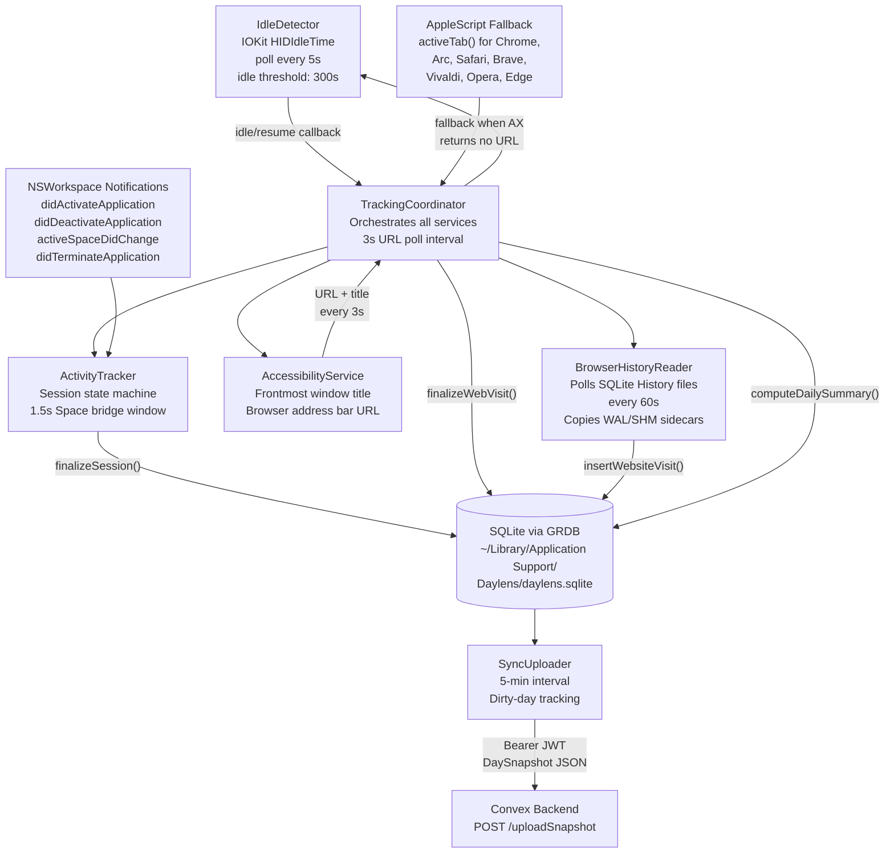

### Session lifecycle

1. **NSWorkspace** fires `didActivateApplication` → `ActivityTracker.handleAppActivation()`
2. Stores app in `currentApp` (bundleID, appName, timestamp)
3. On different app activation → `finalizeSession()` writes `AppSession` row
4. **Space transitions**: same-app deactivate/reactivate within **1.5 seconds** = seamless bridge (no gap)
5. **App termination**: session finalized immediately

### Idle detection state machine

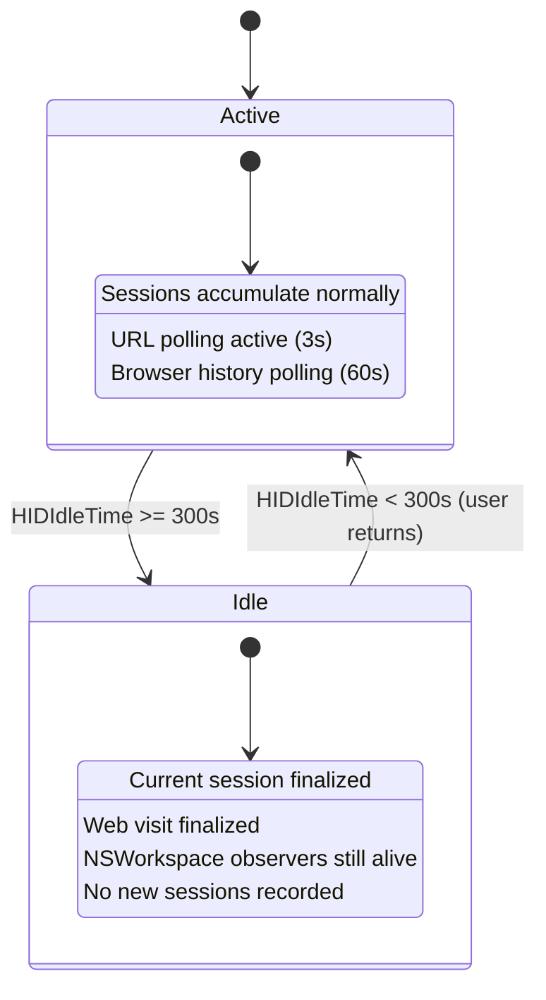

### Website tracking (dual-layer)

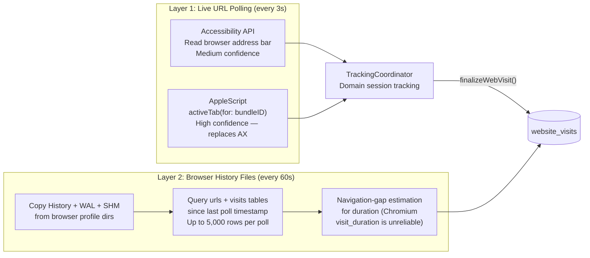

**Why two layers?**
- Layer 1 captures what you're looking at *right now* (live URL from the active tab)
- Layer 2 backfills history from browser SQLite files — catches tabs you visited but didn't stay on long enough for polling

**Supported browsers (macOS)**:
Chrome, Arc, Safari, Brave, Vivaldi, Opera, Edge, Firefox (history only)

---

## 3. Windows Tracking Pipeline

Electron app with native modules. Similar architecture, different system APIs.

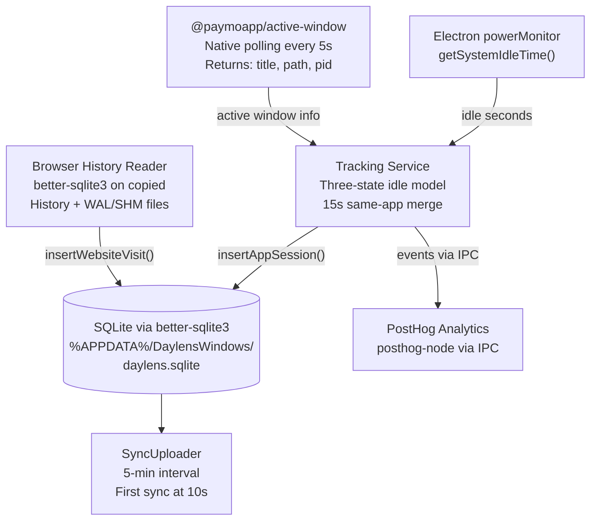

### Three-state idle model

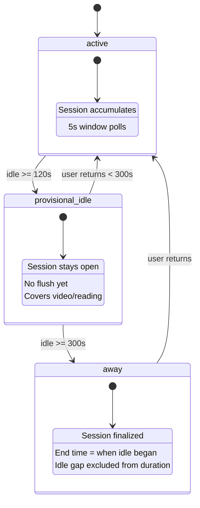

**Why three states instead of two?** The provisional_idle state (120–300s) keeps the session open for passive activities — watching videos, reading long articles. Only after 5 full minutes of no input does the session end.

**Supported browsers (Windows)**: Chrome, Edge, Brave (Firefox not supported — different SQLite schema)

---

## 4. Data Storage

### Storage comparison

| Aspect | macOS | Windows | Web Backend | Web Frontend |
|--------|-------|---------|-------------|--------------|
| **Database** | SQLite (GRDB) | SQLite (better-sqlite3) | Convex cloud DB | None (read-only) |
| **DB Path** | `~/Library/Application Support/Daylens/daylens.sqlite` | `%APPDATA%/DaylensWindows/daylens.sqlite` | Convex-managed | — |
| **Credentials** | Keychain (`com.daylens.app` + `com.daylens.sync`) | Windows Credential Manager (keytar, service: `DaylensWindows`) | `CONVEX_ENCRYPTION_SECRET` env var | JWT in HttpOnly cookie |
| **API Key** | Keychain (plaintext, local only) | Credential Manager (plaintext, local only) | AES-256-GCM encrypted in `encrypted_keys` table | Never seen by browser |
| **Backup** | Rolling daily (7 files in `Backups/`) | None | Convex auto-backup | — |
| **Sync** | 5-min upload + on-quit + on focus-session change | 5-min upload + first sync at 10s + on-quit | Receive only | 30s polling via `Poller` component |

### macOS database schema

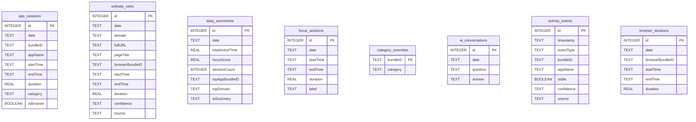

**Migrations** (additive only — `eraseDatabaseOnSchemaChange` is permanently banned):

| Version | Adds | Notes |
|---------|------|-------|
| `v1_create_tables` | All base tables | Baseline schema |
| `v2_focus_sessions` | `focus_sessions` | Focus timer feature |
| `v3_category_overrides` | `category_overrides` | User category corrections |

### Convex database schema

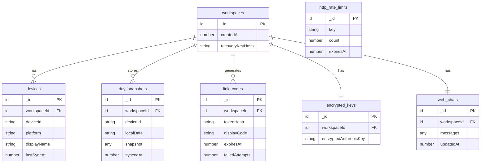

### Keychain / credential storage detail

**macOS Keychain** (`com.daylens.app`):
- `anthropic_api_key` — user's Anthropic API key (local AI chat)

**macOS Keychain** (`com.daylens.sync`):
- `sync-device-id` — UUID identifying this Mac
- `sync-session-token` — Convex JWT (365-day lifetime)
- `sync-public-workspace-id` — workspace identifier
- `sync-convex-url` — Convex HTTP endpoint URL
- `recovery-mnemonic` — BIP39 12-word recovery phrase

**Windows Credential Manager** (service: `DaylensWindows`):
- `workspaceId`, `workspaceToken`, `deviceId`, `recoveryMnemonic`

**Web browser**:
- `daylens_session` cookie — JWT (HttpOnly, Secure, SameSite=Strict, 30-day expiry)

---

## 5. Cross-Platform Sync

### Full linking and sync sequence

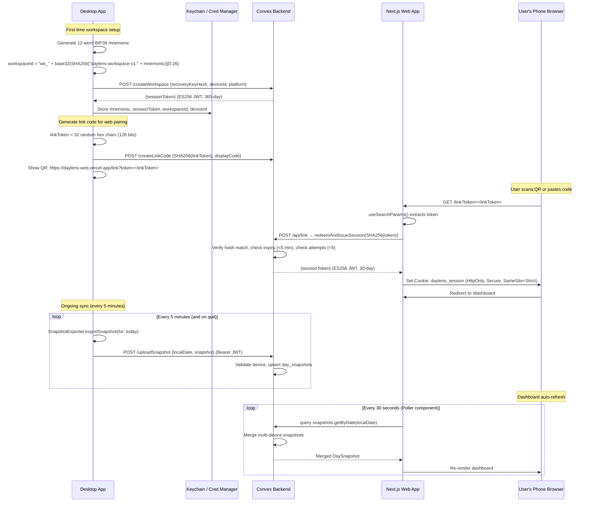

### DaySnapshot v1 contract

Every sync upload sends this JSON structure:

| Field | Type | Description |
|-------|------|-------------|
| `schemaVersion` | `1` | Locked — never changes without new version |
| `deviceId` | UUID | Source device identifier |
| `platform` | `"macos"` / `"windows"` | Source platform |
| `date` | `"2026-03-22"` | Local calendar date |
| `generatedAt` | ISO8601 | When this snapshot was built |
| `isPartialDay` | boolean | True if day is still in progress |
| `focusScore` | `0–100` | Integer percentage |
| `focusSeconds` | int | Total focused time in seconds |
| `appSummaries` | array | Per-app: `{appKey, bundleID, displayName, category, totalSeconds, sessionCount}` |
| `categoryTotals` | array | Per-category: `{category, totalSeconds}` |
| `timeline` | array | Ordered: `{appKey, startAt, endAt}` |
| `topDomains` | array | Per-domain: `{domain, seconds, category}` |
| `categoryOverrides` | map | User-corrected: `{bundleID: category}` |
| `aiSummary` | string? | AI-generated day narrative |
| `focusSessions` | array | `{sourceId, startAt, endAt, actualDurationSec, targetMinutes, status}` |

### Multi-device snapshot merging

When the web dashboard queries a date with data from multiple devices (e.g., macOS + Windows):

1. Load all `day_snapshots` for (workspaceId, localDate)
2. For each device's snapshot:
   - Sum `appSummaries` by `appKey` (accumulate totalSeconds, sessionCount)
   - Sum `categoryTotals` by category
   - Concatenate + sort timelines by `startAt`
   - Combine focus sessions (prefix sourceId with deviceId)
   - Merge `categoryOverrides` (latest wins)
   - Keep latest `aiSummary`
3. Recompute `focusScore` from merged data
4. Return merged snapshot + per-device metadata

### Link code security

| Property | Value |
|----------|-------|
| Token length | 32-char hex (128 bits entropy) |
| Server stores | SHA256(token) only — never plaintext |
| Expiry | 5 minutes |
| Rate limiting | 3 failures → 1 min lock, 5 failures → 10 min lock |
| Cleanup | Expired codes deleted when new code is created |

---

## 6. Focus Score

Both platforms use the same formula:

```
score = focusRatio × (1 - switchPenalty)

where:
  focusRatio    = (focusedTime + websiteFocusCredit) / totalTime
  switchRate    = sessionCount / max(totalTime / 3600, 0.1)
  switchPenalty = min(switchRate / 300, 0.15)    ← max 15% penalty
```

### Category classification

| Category | Focused? | Color (dark) |
|----------|----------|-------------|
| development | Yes | `#b4c5ff` |
| research | Yes | `#c084fc` |
| writing | Yes | `#93c5fd` |
| aiTools | Yes | `#e879f9` |
| design | Yes | `#f472b6` |
| productivity | Yes | `#6ee7b7` |
| communication | No | `#4fdbc8` |
| email | No | `#67e8f9` |
| browsing | No | `#fb923c` |
| meetings | No | `#ffb95f` |
| entertainment | No | `#f87171` |
| social | No | `#a78bfa` |
| system | No | `#94a3b8` |
| uncategorized | No | `#64748b` |

Category overrides (user-assigned) take priority over auto-classification in **all** query paths: live UI, persisted summaries, snapshot exports, and AI context.

---

## 7. Web Application Architecture

The web app is a **read-only companion** — it never tracks activity itself. It reads snapshot data uploaded by desktop apps via Convex.

### Route map

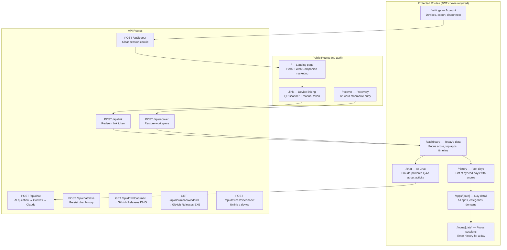

### Middleware auth flow

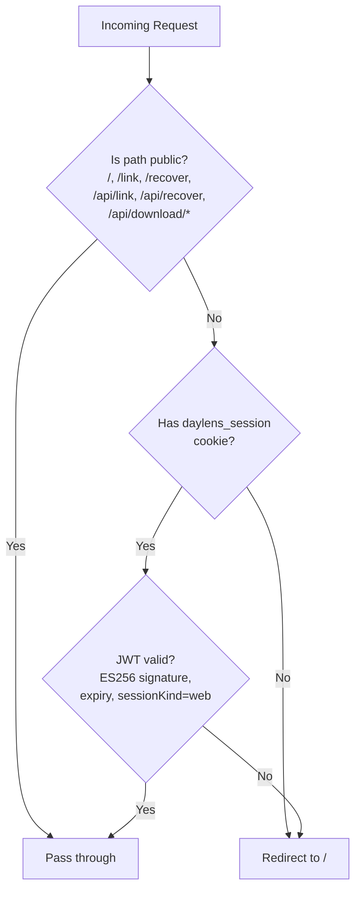

### AI chat data flow

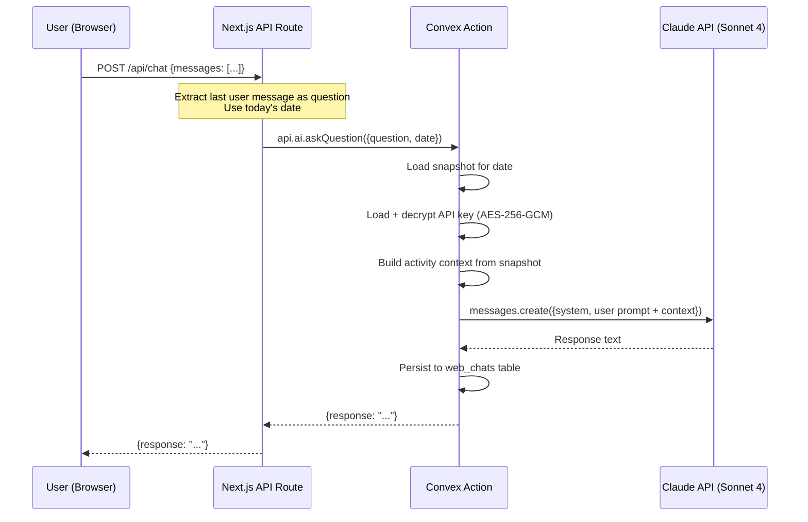

### API key encryption

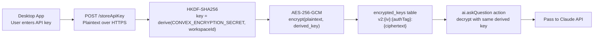

---

## 8. Analytics (PostHog)

Single PostHog project shared across web and Windows. **macOS has no analytics.**

### Configuration

| Platform | Package | Version | Init |
|----------|---------|---------|------|
| Web | `posthog-js` | 1.363.1 | `providers.tsx` — `capture_pageview: true, capture_pageleave: true` |
| Windows | `posthog-node` | 5.28.5 | `analytics.ts` — `flushInterval: 30_000`, IPC bridge from renderer |
| macOS | — | — | Not integrated |

**Project**: `phc_d0IcV73kr5HKVVY3UGGdUf9Meq1sKE3dJxcVq9ZjkCW`
**Host**: `https://us.i.posthog.com`

### Event catalog

#### Web events

| Event | Location | Properties |
|-------|----------|-----------|
| `link_pairing_started` | `link/page.tsx` | — |
| `link_pairing_completed` | `link/page.tsx` | — |
| `download_clicked` | `DownloadButtons.tsx` | `platform: 'mac' \| 'windows'` |
| Page views | Auto-captured | Standard browser props |
| Page leaves | Auto-captured | Standard browser props |

#### Windows events

| Event | Location | Properties |
|-------|----------|-----------|
| `app_launched` | `index.ts` | `version`, `platform`, `os_version`, `onboarding_complete` |
| `tracking_engine_status` | `index.ts` | `status`, `module_source`, `error_message?` |
| `update_available` | `updater.ts` | `version` |
| `update_downloaded` | `updater.ts` | `version` |
| `update_error` | `updater.ts` | `error_message` |
| `crash` | `index.ts` | `error_name`, `error_message`, `stack` |
| `onboarding_step_completed` | `Onboarding.tsx` | `step: 1 \| 2`, `goals?` |
| `onboarding_completed` | `Onboarding.tsx` | `goals`, `api_key_entered` |
| `api_key_saved` | `Onboarding.tsx`, `Settings.tsx` | — |
| `insight_generated` | `Insights.tsx` | `message_length` |
| `focus_session_started` | `Focus.tsx` | — |
| `focus_session_ended` | `Focus.tsx` | `duration_seconds`, `completed: true` |
| `feedback_submitted` | `FeedbackModal.tsx` | `score` (1-10), `comment?` |
| `view_opened` | `App.tsx` | `view` |

### Privacy

- **Anonymous**: UUID-only identification (generated on first launch, stored in electron-store)
- **No PII**: No names, emails, or API keys sent
- **No opt-out**: No consent mechanism currently implemented
- **Errors silenced**: Analytics failures never crash the app

### Windows IPC bridge

```
Renderer → ipcRenderer.send('analytics:capture', event, props)
    → ipcMain.on('analytics:capture') → posthog.capture()
```

All network calls happen in the main process — renderer never touches PostHog directly.

---

## 9. Brand & Design System

### Design theme: "Chromatic Sanctuary"

Deep navy dark mode with electric blue accent. Full light/dark mode support via system preference detection.

### Color palette

#### Primary

| Token | Light | Dark |
|-------|-------|------|
| Primary | `#2563eb` | `#b4c5ff` |
| Accent (bright) | `#68AEFF` | `#68AEFF` |
| Primary Container | `#2563eb` | `#2563eb` |
| On Primary | `#ffffff` | `#051425` |

#### Surfaces (dark mode)

| Token | Hex |
|-------|-----|
| Surface Lowest | `#010f20` |
| Surface | `#051425` |
| Surface Low | `#0d1c2e` |
| Surface High | `#1d2b3d` |
| Surface Highest | `#283648` |
| Surface Bright | `#2c3a4d` |

#### Surfaces (light mode)

| Token | Hex |
|-------|-----|
| Surface Lowest | `#eef2fb` |
| Surface | `#f3f6fd` |
| Surface Container | `#e8eef8` |
| Surface Card | `#ffffff` |
| Surface High | `#dde5f5` |

#### Text

| Token | Light | Dark |
|-------|-------|------|
| On Surface | `#0d1f38` | `#c8dcf4` |
| On Surface Variant | `#4a6180` | `#5e7a92` |

#### Semantic

| Token | Light | Dark |
|-------|-------|------|
| Secondary (amber) | `#d97706` | `#ffb95f` |
| Tertiary (teal) | `#0d9488` | `#4fdbc8` |
| Error | `#b91c1c` | `#f87171` |
| Success | — | `#34d399` |
| Warning | — | `#fbbf24` |

### CTA gradient

```css
background: linear-gradient(180deg, #68AEFF 0%, #003EB7 100%);
```

### Typography

| Context | macOS (SwiftUI) | Web (Tailwind/CSS) |
|---------|-----------------|-------------------|
| System font | SF Pro Display / SF Pro Text | Inter, system-ui, sans-serif |
| Monospace | — | JetBrains Mono |
| Nav labels | `.body` (13pt) | `text-sm` (14px) |
| Body text | 13–14pt minimum | 14px |
| Section headers | 10pt uppercase, tracked | 10px uppercase, `letter-spacing: 0.08em` |
| Tiny badges | 9–10pt | `0.625rem` (10px) |
| Hero headline | — | `clamp(2rem, 5vw, 3.5rem)` |

### Spacing (8pt grid)

```
2px → 4px → 6px → 8px → 10px → 12px → 14px → 16px → 18px → 20px → 24px → 28px → 32px → 40px → 48px
```

### Border radius

| Token | Value |
|-------|-------|
| Small | 4px |
| Medium | 8px |
| Large | 12px |
| XL | 16px |
| Full (pill) | 999px |

### Component patterns

| Component | Style |
|-----------|-------|
| Cards | `p-4 sm:p-6`, `rounded-2xl`, `bg-surface-low`, soft shadow (0.07 opacity) |
| Buttons (primary) | Gradient fill, `rounded-xl`, `font-semibold`, 200ms transitions |
| Section headers | 10pt uppercase, tracked, `DS.onSurfaceVariant` color |
| Glass effect | `rgba(13, 28, 46, 0.7)` background, `blur(16px)` backdrop |
| Focus glow | `box-shadow: 0 0 8px 2px rgba(180, 197, 255, 0.3)` |

### App icons

| Platform | Path | Sizes |
|----------|------|-------|
| macOS | `Daylens/Resources/Assets.xcassets/AppIcon.appiconset/` | 16–1024px + @2x |
| Windows | `daylens-windows/build/` | `icon.png`, `icon.icns`, `icon.ico` |
| Web | `daylens-web/public/` | `app-icon.png`, `icon-192.svg`, `icon-512.svg` |

---

## 10. Key URLs

| Resource | URL |
|----------|-----|
| Web Dashboard | https://daylens-web.vercel.app |
| Landing Page | https://daylens-web.vercel.app |
| Convex Site API | https://decisive-aardvark-847.convex.site |
| Convex Cloud | https://decisive-aardvark-847.convex.cloud |
| macOS Releases | https://github.com/irachrist1/daylens/releases |
| Windows Releases | https://github.com/irachrist1/daylens-windows/releases |
| PostHog Dashboard | https://us.i.posthog.com (project: phc_d0IcV73kr5HKVVY3UGGdUf9Meq1sKE3dJxcVq9ZjkCW) |

---

## 11. Release & CI

### macOS

Workflow: `.github/workflows/release.yml` — triggered on `v*` tag push to `main`

```
Tag push → checkout → Xcode 16.2 → xcodegen + build → create-dmg → extract CHANGELOG → GitHub Release
```

Artifacts: `Daylens-{version}.dmg` + `.sha256`

### Windows

Workflow: `release-windows.yml` — triggered on `v*-win` tag

Artifacts: `Daylens-Setup-{version}.exe`

### Web

Auto-deploy on push to `main` via Vercel. No manual CI step.
