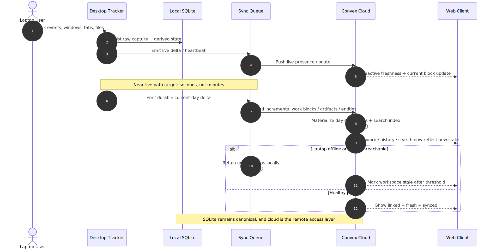

# Daylens Architecture Diagrams

These diagrams are the visual companion to [PRD.md](../PRD.md) and [SRS.md](../SRS.md). The Mermaid sources live beside the rendered SVGs so the system view stays editable.

## 1. Remote System Context

Shows the high-level product split: desktop capture stays canonical, cloud becomes the remote access layer, and web/mobile consume linked synced state.

## 2. Near-Live Sync

Shows the difference between live presence updates and durable history sync. This is the main correction to the current 5-minute-only remote behavior.

## 3. Remote AI Orchestration

Shows the target parity model: shared Daylens AI contract, local/cloud evidence adapters, per-job model routing, and Daylens-owned persistence.

## 4. Observability And Rollout

Shows the intended split between Sentry and PostHog, plus the release gates and rollback path for remote features.
