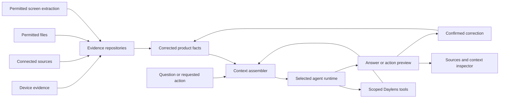

# Agent runtime and context

**Status:** Ready for review.

This specification defines how Daylens gives an agent enough information to understand a person’s day without handing a model an unbounded dump of their digital life. It owns context assembly, provider-independent runtime behavior, file and connector disclosure, tool scoping, and the evidence required for an agent to answer or act.

The [AI agent specification](ai-agent.md) defines the product experience, voice, questions, and Daylens actions. This specification defines the infrastructure underneath that experience. Capture, memory, connectors, Timeline, and Apps remain the owners of their product facts; the agent consumes those facts through narrow interfaces.

## Product behavior

The agent should feel ready to answer without requiring the person to reconstruct the relevant applications, files, meetings, or projects first.

For “How did my day go?”, Daylens should provide enough context to explain the meaningful sequence of the day, including what the person worked on, which meetings occurred, the people and projects involved, useful outcomes supported by evidence, personal activity that was not excluded, and genuine gaps in the record.

For a narrower question such as “What did I do for ACME?”, Daylens should restrict the initial context to the requested period and resolved ACME entities, then let the agent retrieve specific supporting evidence as needed.

The goal is not to maximize the amount of context sent to a model. The goal is to provide the smallest set of permitted facts and evidence required to answer the current question accurately.

## Product boundary

Daylens owns:

- canonical evidence, corrected activity facts, entities, and memory
- time, duration, identity, permission, sensitivity, retention, and deletion rules
- context selection and disclosure
- tools and their authorization boundaries
- action preview, confirmation, execution, and undo state
- conversation records and confirmed conversational memory
- the interpretation and voice rules shared by Timeline, Apps, search, and the agent

The selected agent runtime owns:

- the agent loop for one request or resumable session
- model interaction and streaming
- tool selection from the tools Daylens provides
- structured output requested by Daylens
- cancellation, interruption, and runtime-specific usage reporting

A provider runtime never becomes the source of Daylens facts. Changing from one supported runtime to another must not change durations, entity identity, corrections, permissions, or source provenance.

## System flow



The context assembler is a Daylens domain service. It is not embedded inside a provider adapter or prompt template.

## Agent roles

Daylens uses one runtime boundary for three distinct roles.

### Interpretation agent

The interpretation agent receives a bounded group of evidence and proposes understandable activity, subjects, relationships, and descriptions. It may help determine that browser research, files, a repository, and a meeting relate to one project.

Its output is stored as versioned inference with source evidence, confidence, interpretation-policy version, model and runtime version, and creation time. It never overwrites the evidence that produced it. Reprocessing the same evidence may replace an automated inference but cannot override a person’s correction.

### Question-answering agent

The question-answering agent receives a question-specific context packet and narrow read tools. It retrieves, reconciles, calculates, and explains. Deterministic Daylens queries own totals, counts, dates, and entity relationships.

### Action agent

The action agent receives the resolved target, relevant current state, proposed change, permission state, and confirmation requirement. In V2 it can only preview and apply reversible changes inside Daylens as defined in the [AI agent specification](ai-agent.md).

These roles may share an implementation initially. Their permissions, tools, context, evaluation, and stored output remain distinguishable.

## Information authority

When sources disagree, Daylens applies this order:

1. A person’s explicit correction or confirmed supplied fact.
2. Direct observation from a permitted device source.
3. A source-native fact from a consented connector.
4. A corroborated fact supported by independent evidence.
5. A reversible inference derived from evidence.
6. Generated language used only to present supported facts.

This order is not a universal measure of source quality. A calendar event can authoritatively prove what was scheduled while device or transcript evidence is still required to claim that the meeting occurred. Each claim is evaluated against the source capable of supporting it.

Generated language never becomes durable memory merely because a model produced it. A conversationally learned fact becomes durable only after the person confirms it, at which point it is stored as supplied memory.

## Context packet

Every agent run begins with a typed, inspectable `AgentContextPacket`.

```ts
interface AgentContextPacket {
  contextId: string
  purpose: 'interpret' | 'answer' | 'act'
  request: {
    originalText: string
    resolvedIntent: string
    timeRange: TimeRange | null
    entityIds: string[]
  }
  person: {
    timezone: string
    confirmedPreferences: ConfirmedPreference[]
  }
  facts: ProductFact[]
  activity: ActivityBlockSummary[]
  entities: EntitySummary[]
  evidence: EvidenceExcerpt[]
  conflicts: EvidenceConflict[]
  gaps: EvidenceGap[]
  permissions: ContextPermission[]
  tools: AgentToolDescriptor[]
  disclosure: ContextDisclosure
  policyVersion: number
}
```

The packet contains stable identifiers rather than relying on display names to join facts. Every factual item retains its memory or evidence identifiers, source type, sensitivity, confidence, and effective time.

`ContextDisclosure` records which facts and excerpts were made available, their sensitivity, why they were selected, whether they left the device, the provider and model destination, and any redaction or omission. It never stores provider credentials or hidden security instructions.

## Context assembly

The assembler performs these steps in order:

1. Classify the request as interpretation, answer, or action without changing its original text.
2. Resolve explicit and relative time using the person’s timezone.
3. Resolve named people, applications, pages, files, meetings, repositories, projects, clients, and aliases.
4. Query corrected structured facts before broad text or semantic search.
5. Retrieve exact and semantic memory within the resolved time and entity scope.
6. Retrieve connected or file evidence only when local product facts cannot support the requested detail.
7. Apply exclusions, sensitivity rules, provider permissions, and redaction before ranking content for inclusion.
8. Reconcile duplicates and expose meaningful conflicts instead of silently choosing a convenient source.
9. Rank by relevance, source fitness, correction authority, time fit, and information gain.
10. Fit the initial packet within a configured context budget without removing evidence required to support the answer.
11. Expose narrow tools for additional investigation rather than preloading every potentially related record.
12. Record the final disclosure before the request leaves the local Daylens boundary.

Context assembly is deterministic for the same request, permitted facts, policy version, and context budget. Model output is not used to decide whether excluded information may enter the packet.

## Initial context and on-demand retrieval

The initial packet should orient the agent, not complete every possible investigation.

For a full-day question, the initial packet may include:

- the requested date and timezone
- the sequence of corrected Timeline blocks
- resolved meetings and whether evidence supports that they occurred
- project, client, person, repository, file, page, and application relationships
- deterministic durations and meaningful transitions
- significant connected events such as a pull request, issue change, or meeting note
- capture gaps, exclusions that affect completeness, and material source conflicts

It should not include every foreground sample, URL, message, transcript, document body, screen extraction, or unrelated conversation.

The agent retrieves supporting detail through tools when it needs to name a subject, explain an outcome, find an exact artifact, or verify a relationship. Tool responses use the same context policy and disclosure recording as the initial packet.

## Day understanding

Daylens constructs a day from activity blocks and their relationships rather than from an application-usage list.

An interpretable block can contain:

- start, end, active duration, and gaps
- the understood activity and subject
- people, meeting, project, client, repository, page, file, and application entities
- evidence supporting each relationship
- relevant connected events before, during, or after the block
- observed, connected, supplied, and inferred claims
- confidence, conflicts, and missing evidence
- corrections and their effect on the interpretation

The agent may say that someone developed a feature, read an article, reviewed a report, attended a meeting, or researched a purchase when the evidence supports that language. It does not convert foreground application time into proof of comprehension, completion, attendance, or outcome.

The day context does not assign productivity, focus, distraction, or quality scores. Short observations such as “Solid session there” are presentation and must remain grounded in the visible shape of the activity rather than a hidden behavioral score.

## File and document access

File access has three separate states:

1. **Observed:** Daylens knows that a file was active and retains permitted metadata.
2. **Indexed:** Daylens has locally extracted permitted text or structure for search.
3. **Model-readable:** A relevant excerpt may be disclosed to the selected model for the current request.

Granting one state does not silently grant the next.

Observed file metadata may include stable file identity, display name, extension, permitted path or folder identity, application, activity interval, content version or fingerprint, and relationships to projects, clients, meetings, repositories, pages, and Timeline blocks.

Indexing follows these rules:

- A person grants access to a named file, folder, or connector boundary.
- Hidden, system, temporary, credential, keychain, browser-profile, and excluded paths are denied by default.
- Daylens extracts only supported content types and reports unreadable or encrypted files without bypassing their protection.
- Extracted text inherits the file’s sensitivity and deletion state.
- A summary or embedding is bound to the file version that produced it and becomes stale when that version changes.
- Removing access deletes unsupported extracted text, embeddings, summaries, and cached excerpts.

Model disclosure follows these rules:

- The assembler sends the smallest relevant excerpt, not the complete file by default.
- The packet explains the file identity, version, excerpt location, and reason for selection.
- High-sensitivity content requires an explicit model-access permission in addition to file or folder access.
- An agent runtime does not receive unrestricted filesystem, shell, or browser tools.
- A provider’s built-in file tools remain disabled unless they are routed through a Daylens permission and disclosure boundary.

Daylens may answer that a file was used without reading its contents. It reads or discloses content only when the question requires content-level understanding and the permission allows it.

## Connector context

A connected source makes permitted records retrievable; it does not preload the source into every conversation.

- Calendar metadata can identify what was scheduled. Attendance language requires corroboration or confirmation.
- GitHub and Linear can connect activity to repositories, issues, pull requests, reviews, and projects without proving unrelated work or completion.
- Granola can provide meeting notes and permitted transcript excerpts without giving every question the full transcript.
- Communication bodies remain high-sensitivity and are retrieved only for an explicit question whose answer requires them.
- A broker such as Composio remains behind the Daylens connector and context contracts.

The agent may request a specific connection when it identifies a material evidence gap. It explains what the source would add and does not request unrelated connections.

## Screen-derived context

Screen extraction is fallback evidence governed by the [screen-context specification](screen-context.md). A raw frame never enters an agent context packet.

Only successfully extracted, permitted, sensitivity-labelled evidence can be retrieved. The context inspector identifies screen extraction as its source. Deleting the raw frame does not remove the provenance of the permitted derived fact, while deleting the derived evidence removes it from context, memory, and indexes.

## Tool and skill scoping

The normal conversational agent starts with the smallest useful Daylens tool set. Tool descriptions are added according to the request, resolved entities, available connections, and permissions.

- The front agent receives memory, fact, evidence, clarification, and permitted Daylens action tools.
- Connector tools are made available only when the source is connected and relevant.

When a selected runtime provides workers, subagents, skills, or tool search, these constraints bind. They describe boundaries for capabilities a future runtime may add, not work the first implementation must build:

- A specialized worker receives only the tools, time range, entities, and context required for its task.
- A worker cannot expand its permissions by spawning another worker.
- Subagents are used only when a bounded task materially benefits from independent context or parallel investigation.
- Skills are not globally injected into every Daylens conversation.
- A person explicitly selects a skill before its instructions enter the agent context.
- Provider-specific skills cannot change Daylens permissions, evidence meaning, or action confirmation.
- Tool search may expose the name and one-sentence purpose of an eligible tool without loading its complete instructions or source catalogue.

Tool calls remain typed, validated, cancellable, and auditable.

### User-configured MCP servers

A person may attach their own MCP servers to the conversational agent. They are a consented tool source, not part of Daylens memory:

- A server runs only after the person adds it explicitly in Settings; nothing is auto-discovered or auto-started.
- A server child process inherits only the environment needed to launch and locate its runtime, never the Daylens process environment, which can carry provider keys and tokens. Anything else a server needs is set explicitly in its settings entry.
- MCP tool results are treated as untrusted input: they cannot change Daylens permissions, bypass the machine-tool path policy, or trigger a Daylens action without the normal preview and confirmation.
- Context inspection identifies which MCP server a tool result came from.
- A failing server is skipped with a visible warning and never breaks the conversation.

## Runtime contract

Provider implementations conform to one Daylens-owned interface.

```ts
interface AgentRuntime {
  capabilities(): AgentRuntimeCapabilities
  run(request: AgentRunRequest): AsyncIterable<AgentEvent>
  resume(sessionId: string, input: AgentInput): AsyncIterable<AgentEvent>
  cancel(sessionId: string): Promise<void>
}

interface AgentRunRequest {
  sessionId: string
  context: AgentContextPacket
  tools: AgentToolDefinition[]
  outputSchema: JsonSchema | null
  limits: AgentRunLimits
}
```

The shared event model covers text, structured output, tool request, tool result, permission request, user-input request, usage, warning, completion, cancellation, and failure.

An adapter translates provider events without leaking provider-specific objects into the agent, memory, billing, or UI domains. Unsupported capabilities are reported before a run begins; they are not simulated through hidden behavior.

Managed and bring-your-own-key modes use the same tools, context policy, and answer contract. A subscription-backed adapter is exposed only when the provider explicitly permits the intended third-party product, authentication, and commercial use. Runtime support never implies entitlement to use a person’s unrelated provider subscription.

### Runtime selection

The incumbent runtime is the existing AI SDK streaming loop, kept thin behind this contract. It is sufficient for the V2 scope: read-mostly answering, Daylens-only actions, no proactive sessions.

Adopting a different runtime, including the Claude Agent SDK or a provider app server, is decided by evidence, not on paper: the candidate must run the same accepted context packets and representative-day fixtures through the same tools and match or beat the incumbent on factual correctness, disclosure fidelity, latency, and cost. Until that comparison exists, no work should target a hypothetical second runtime, and the session, subagent, and skill constraints in this specification remain boundaries rather than build items.

## Sessions and interruption

- A Daylens thread owns the durable transcript and links to provider runtime sessions when available.
- Provider session state is an execution detail and can be rebuilt from the Daylens thread plus a fresh context packet.
- Resuming a session rechecks permissions, exclusions, connector state, file versions, and action validity.
- An agent can pause for a login, permission, clarification, or confirmation and resume from an explicit pending state.
- Cancellation stops provider streaming and prevents new tool calls.
- Restart recovery marks incomplete tools and actions accurately rather than assuming success.
- Context is reassembled for a later turn; stale excerpts are not carried forward only because they appeared earlier in the conversation.

## Action readiness

Knowing enough to answer does not automatically authorize an action.

An action context contains:

- the resolved target and current version
- the requested outcome
- the exact proposed change
- the evidence and conversation that motivated it
- the required permission and confirmation state
- an idempotency key
- expected effects on Timeline, Apps, memory, search, and sync
- the available undo operation

The model proposes an action through a typed tool. Daylens validates and renders the preview. A person confirms the immutable preview, and Daylens executes it atomically where possible. If the target changes before confirmation, the preview expires and must be rebuilt.

## Privacy and disclosure

- Exclusions and private-window rules apply before context selection.
- Sensitivity follows evidence into facts, excerpts, embeddings, tool results, traces, and synced threads.
- Provider credentials never enter prompts, tools, logs, exports, or context inspection.
- Context disclosure is recorded locally before a remote model request begins.
- A local runtime still receives only permitted context; local execution does not bypass product privacy controls.
- Analytics never receive questions, answers, titles, URLs, paths, excerpts, names, screenshots, transcripts, or captured content.
- Debug logs use identifiers and state transitions rather than private payloads.
- Deletion removes affected material from future packets, retrieval indexes, cached excerpts, provider-side state controlled by Daylens, and synced copies.

## Context inspection

Every completed answer exposes a compact source indicator. On demand, the person can inspect:

- the resolved time range and entities
- the product facts initially supplied
- every tool and connected source consulted
- the exact excerpts disclosed to a remote model
- observed, connected, supplied, corroborated, and inferred claims
- material conflicts and gaps
- information omitted because of exclusion, sensitivity, or unavailable permission
- provider, model, local or remote execution, and usage

The inspector does not expose hidden model reasoning, provider system prompts, credentials, or security instructions. It shows the inputs, operations, and supported conclusions required to understand and challenge the answer.

## Failure behavior

- Insufficient context produces a supported partial answer, one material clarification, or a specific request for a source or permission.
- A context-budget limit removes lower-ranked optional evidence before required supporting evidence.
- A connector, file, or index failure remains attached to the affected source and does not invalidate independent local facts.
- A stale file summary is not presented as current content.
- Conflicting evidence remains visible until a deterministic rule, authoritative source, or person resolves it.
- Provider failure preserves the question, context reference, and completed read-only tool results for a safe retry.
- Switching providers rebuilds the packet under the same current policy rather than forwarding a provider-private transcript blindly.
- An interpretation failure preserves the underlying evidence and does not create durable memory.
- An action failure records whether nothing changed, the change completed, or the outcome is genuinely unknown. It never reports success from model language alone.

## Evaluation

Evaluation begins with representative day fixtures, not isolated prompts. Fixtures extend the existing offline `tests/timeline-eval` fixture format — which already seeds sessions, browser evidence, and activity boundaries — with connector records, files, permissions, corrections, and expected answers, rather than introducing a second fixture system. Fixtures include:

- development across an editor, browser, GitHub, and Linear
- a meeting-heavy day using Calendar and Granola
- two clients using the same applications and websites
- mixed work, personal, and entertainment activity
- permitted files with metadata-only, indexed, and model-readable states
- missing capture and disconnected sources
- contradictory calendar, device, and transcript evidence
- explicit corrections that conflict with later automated inference
- excluded, private, deleted, and high-sensitivity evidence
- long histories where only a narrow period and entity are relevant

Each fixture defines the expected facts, acceptable interpretations, prohibited claims, required sources, prohibited disclosures, and useful questions.

Failures are classified as:

1. capture
2. normalization
3. entity resolution
4. product-fact projection
5. retrieval
6. context assembly
7. tool execution
8. model reasoning
9. presentation
10. action execution

Measurements include factual correctness, retrieval completeness, deterministic calculation accuracy, source support, conflict handling, correction adherence, privacy leakage, unnecessary disclosure, context size, latency, cost, and answer usefulness. Model comparisons use the same accepted context packet and tool results where the runtime permits it.

## Acceptance criteria

- Representative questions receive enough context to produce specific answers without preloading an entire day’s raw evidence.
- Every factual claim in an answer can be traced to a product fact, evidence record, deterministic calculation, or confirmed supplied memory.
- Deterministic totals and identities remain the same across supported runtimes.
- Context packets never contain excluded, deleted, unavailable, or unauthorized content.
- File observation, local indexing, and model disclosure remain separate permissions with tested revocation.
- Connector content is retrieved only when relevant to the current request.
- Raw screen frames never enter agent context.
- A person can inspect the facts, tools, sources, excerpts, gaps, and provider involved in an answer.
- Skills and unrelated connector catalogues are not globally loaded into conversations.
- The interpretation agent cannot override corrections or turn generated prose into recorded fact.
- Provider or model changes do not silently expand context, tools, permissions, or subscription entitlement.
- An answer can be retried with another runtime without changing the underlying Daylens facts.
- An action cannot execute from answer context alone; it requires a valid preview and confirmation.
- Evaluation can identify whether a wrong answer originated in capture, retrieval, context assembly, model reasoning, or presentation.
- The running product is tested with representative real days in addition to synthetic fixtures.

## Implementation starting point

The first implementation ticket should define the provider-independent context packet, disclosure record, and representative day fixtures. It should assemble and inspect a packet without calling a model.

The next tickets should add deterministic context assembly, narrow read tools, the context inspector, and runtime adapters in that order. The interpretation agent begins with offline fixture evaluation before it writes any inferred product state. Action tools begin only after read-only answers satisfy the accepted context and accuracy fixtures.
