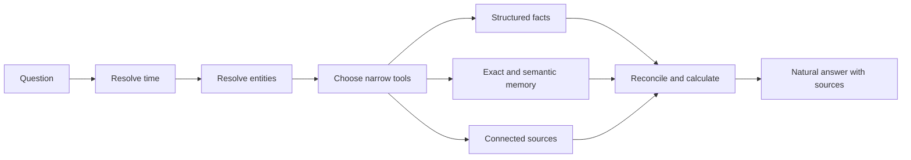

# AI agent

**Status:** Ready for review.

This specification defines the AI agent as the conversational interface to Daylens memory. It retrieves, calculates, explains, compares, and corrects information using the same facts as Timeline, Apps, and search.

The agent is not a general chatbot placed beside a time tracker. It should feel as if it already understands the person’s days while remaining honest about what Daylens does and does not know.

The [agent runtime and context specification](agent-runtime-and-context.md) defines how Daylens assembles the permitted facts, files, excerpts, tools, and provider-independent runtime used to produce this behavior.

## Product behavior

The agent answers questions such as:

- “How much time did I spend on Project X last month, and what did I do?”
- “Which meetings did I have with ACME in June?”
- “Where was the article about prompts being technical debt?”
- “What did I work on last week besides meetings?”
- “Correct this block: that was client research, not entertainment.”

A person does not need to list the relevant applications or paste background Daylens already has.

## Voice

The agent describes what happened before describing the telemetry used to infer it.

It should say:

- “You actively developed the Daylens Wrapped feature for 2h 14m.”
- “You read Sean Goedecke’s article for 12 minutes. It was about how prompts are technical debt, too.”
- “You spent 30 minutes reviewing ACME’s FY2026–2027 financial report with Norman and the team.”

It should not lead with “the editor was active,” “the calendar contained,” or “based on the available metadata.”

A short observation such as “Solid session there” is welcome when it is relevant and supported. The agent does not assign productivity scores, diagnose distraction, or turn incomplete observation into a personal judgment.

When evidence conflicts, it names the conflict naturally: “I found the meeting on your calendar, but no matching device or Granola activity.”

## Answer contract

Every factual answer contains:

1. A direct answer in natural language.
2. Deterministically calculated durations, counts, dates, and relationships.
3. Relevant context and one useful observation when supported.
4. Inspectable sources and privacy indicators.
5. A clarification or specific uncertainty only when it changes the answer.

The agent never invents a duration, page, file, meeting, person, project, outcome, or completion state. An application being foreground is evidence of activity, not automatic proof that an article was fully absorbed or a task was finished. Stronger language requires supporting page dwell, repeated interaction, connected records, an explicit statement, or another accepted signal.

## Agent flow



The model chooses tools and phrasing. Tools own time, identity, permission, filtering, evidence, and mutations.

## Tool primitives

The first tool set is deliberately small:

1. Resolve a natural-language time range and timezone.
2. Resolve an application, page, file, person, meeting, repository, project, or client.
3. Retrieve corrected Timeline blocks for a period and filters.
4. Aggregate canonical time by application, website, project, client, meeting, person, or category.
5. Search exact and semantic memory.
6. Retrieve supporting evidence and source links.
7. Query one connected source through the Daylens connector boundary.
8. Compare periods or entities using the same calculation.
9. Explain missing evidence or request one clarification.
10. Preview and apply a reversible Daylens correction.
11. Propose a conversational memory for explicit confirmation.

Tools accept typed, validated input and return compact product facts. They do not expose arbitrary SQL, unrestricted filesystem access, raw provider credentials, or unrestricted connector actions.

### Local machine tools

The shipped agent also answers “what did I ship?” and “where is that document?” through read-only machine tools: file search, file read, directory listing, repository discovery, and an allowlisted read-only git surface. These remain in V2 under one shared boundary:

- Every path resolves, symlinks included, to a visible, non-private location inside the user home directory. Hidden folders, system data, credential stores, dependencies, and build output are denied.
- The git surface accepts read subcommands only and rejects arguments that redirect output, re-point the repository, read files outside it, or invoke external drivers.
- Results disclosed to a model follow the same context-disclosure recording as every other tool, and the [agent runtime and context specification](agent-runtime-and-context.md) governs any future broadening into indexed or high-sensitivity file access.

## Question planning

- Resolve explicit and relative time before retrieval.
- Use the person’s local timezone unless the question names another.
- Resolve named entities and aliases before broad semantic search.
- Prefer deterministic tools for totals, counts, comparisons, and membership.
- Use exact search before semantic search when the question includes distinctive wording.
- Request connector data only when local memory cannot answer reliably.
- Ask one concise clarification when two interpretations would materially change the answer.
- Do not ask a clarification merely because some evidence is incomplete; answer the supported part and state the specific gap.
- Keep tool results inside the minimum time and entity scope needed for the question.

## Sources and model-context inspection

Every answer shows a compact source indicator. On demand, a person can inspect:

- which Daylens facts were retrieved
- which connected sources were called
- which excerpts were sent to the model
- what was omitted because of exclusions or permissions
- which facts were observed, connected, supplied, or inferred

Provider system prompts, security instructions, credentials, and unrelated conversation history are not exposed as evidence.

## Conversation threads

- Threads have stable identity, title, creation time, last activity, and archive state.
- A new thread begins with the current question and relevant Daylens memory, not every previous conversation.
- The person can rename, archive, delete, and later search threads.
- Deleting a thread removes its messages, embeddings, generated artifacts, and synced copy.
- A confirmed conversational memory survives thread deletion as a separate supplied fact and remains visible in memory management.
- Thread history is trimmed or summarized for model context without changing the stored transcript.
- Desktop threads sync to the later web companion through encrypted organized-fact sync.

## Daylens actions

V2 actions are limited to Daylens:

- rename, merge, or split a Timeline block
- change category
- assign or remove a project or client
- correct a meeting relationship
- exclude activity
- forget a saved conversational memory

Every action follows:

```text
propose → preview affected facts and surfaces → confirm → apply atomically → offer undo
```

The agent never sends messages, edits calendars, modifies repositories, or changes external systems in V2. Read-only connectors do not become action tools.

Permanent deletion is not an ordinary agent action. It uses the product’s explicit destructive confirmation and has no undo.

## Conversational memory

The agent may propose saving a durable fact or preference only when it would clearly improve future retrieval or entity resolution.

The proposal shows the exact fact and how it will be used. Saving requires confirmation. Silence, continuing the conversation, or accepting an answer is not confirmation.

## Models

People choose their managed model. The model picker shows:

- provider and model name
- relative quality
- relative speed
- context capability
- current availability
- estimated allowance use for typical Daylens questions

Provider choice cannot change Daylens facts or tool semantics. Unsupported or retired models are removed from new selection and existing selections migrate only with visible notice.

Bring-your-own-key remains permanently available. Keys are stored in the operating-system secure store and sent only to the chosen provider. BYOK remains usable when managed allowance is exhausted.

## Managed access

Managed AI requires an active trial or subscription allowance. Before a request:

- estimate and reserve sufficient credit
- explain when the selected model cannot fit the remaining allowance
- release the reservation if no provider call occurs
- settle actual provider cost after completion or partial completion

When managed access is paused, existing threads remain readable. Local Timeline, Apps, search, corrections, and BYOK agent requests continue to work.

## Proactive behavior

The first V2 agent responds to questions. It does not send proactive daily or weekly briefs.

Later briefs may be introduced only after accepted question fixtures consistently pass. They must use the same retrieval, interpretation, and correction system rather than a separate summarization pipeline.

## Failure behavior

- Provider failure preserves the question and offers retry or another selected model.
- Tool failure returns the supported partial answer and identifies the missing source.
- A timeout or cancellation stops further tools and provider streaming.
- A connector authentication failure does not prompt for unrelated broad access.
- A managed allowance failure occurs before a billable provider request when possible.
- Invalid action input applies nothing.
- A model cannot bypass privacy filters, billing gates, or action confirmation through its own output.
- Existing local facts remain usable during billing, provider, connector, or network outages.

## Evaluation

Accepted fixtures cover:

- time totals by project, client, application, website, meeting, and period
- exact and vague retrieval
- meeting recall
- mixed work and personal activity
- missing, conflicting, excluded, and deleted evidence
- follow-up questions requiring thread context
- model changes producing the same factual answer
- correction preview, confirmation, application, and undo
- natural voice that names the actual activity

Evaluation separates factual correctness, retrieval completeness, calculation accuracy, source support, voice, privacy, and cost.

## Acceptance criteria

- Accepted questions produce correct, specific answers grounded in inspectable evidence.
- Timeline, Apps, search, MCP, and the agent return the same totals and relationships.
- Model choice does not change deterministic facts.
- BYOK and managed modes share tool behavior and privacy boundaries.
- Managed exhaustion pauses managed AI and cloud features without disabling local data or BYOK.
- No Daylens action applies without preview and confirmation, and reversible actions can be undone.
- No conversational fact persists without explicit confirmation.
- Excluded or deleted evidence never appears in prompts, answers, sources, traces, or synced threads.
- Provider, tool, billing, connector, cancellation, and restart failure paths have tests.
- The running agent is reviewed against representative real-day questions, not only synthetic prompts.

## Implementation starting point

The first ticket should make the agent’s read tools consume the shared corrected activity-fact and memory interfaces. It should add accepted answer fixtures before adding new tools or changing the chat interface.
