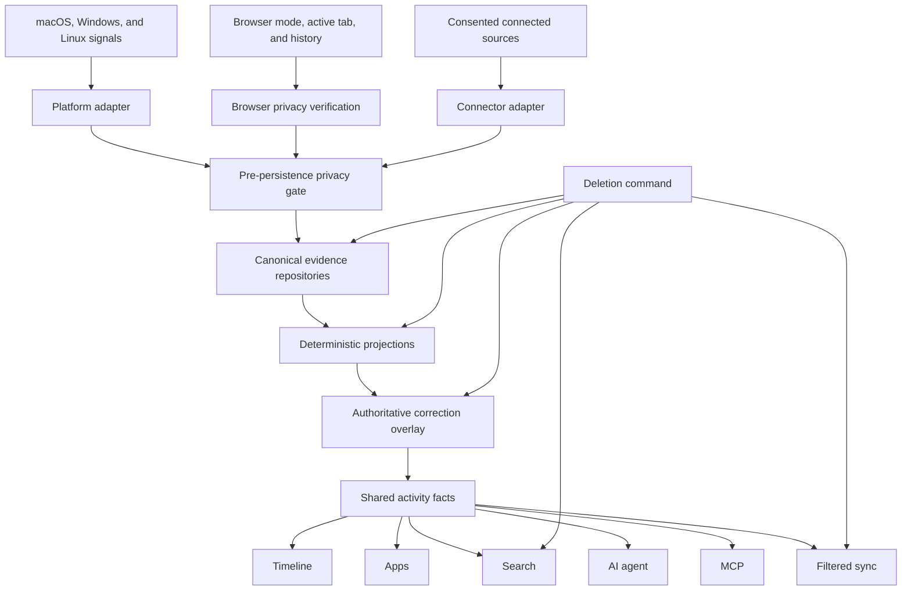

# Capture and evidence

**Status:** Accepted.

This specification defines how Daylens observes computer activity, protects private activity, stores evidence, and exposes one factual foundation to Timeline, Apps, search, memory, the AI agent, MCP, and sync.

The goal is not to collect the most data possible. The goal is to retain the smallest reliable record from which Daylens can explain what happened.

## Product behavior

After onboarding consent and required operating-system permissions, Daylens captures activity across the whole device by default. Work, entertainment, shopping, and general browsing belong to the same private memory.

A person can:

- pause and resume capture immediately
- exclude applications and websites
- see whether capture is healthy
- inspect the evidence underneath an interpretation
- correct an interpretation without rewriting the observed evidence
- permanently delete a record, a block, a source, a period, or the entire history
- export their history

Private windows are never part of Daylens memory. An exclusion is enforced before persistence, not hidden later in the interface.

## Scope

This specification covers:

- foreground applications and windows
- browser pages and history
- idle, lock, sleep, wake, pause, and capture-health events
- the shared evidence contract used by desktop and connected sources
- privacy gates, corrections, deletion, retention, and analytics boundaries
- migration from the current capture paths

It does not specify:

- Timeline block segmentation or visual layout
- project, client, person, or meeting resolution
- connector-specific authentication and synchronization
- screen-frame capture or OCR
- AI answer generation

Those systems consume the evidence defined here and have their own specifications. The screen-context experiment remains a separate opt-in prototype governed by [V2 direction](../product/v2.md#screen-context-experiment).

## Data flow



No product surface reads a native helper, browser database, or raw SQL table directly. Capture adapters produce evidence. Repositories persist it. Shared queries turn it into product facts.

## Canonical evidence contract

Every adapter emits a typed `EvidenceEnvelope`. The envelope is an application boundary, not a requirement to put every source into one generic JSON table.

```ts
interface EvidenceEnvelope<TKind extends EvidenceKind, TPayload> {
  evidenceId: string
  kind: TKind
  source: {
    adapter: string
    deviceId: string
    sourceRecordId: string | null
  }
  observedAtMs: number
  monotonicNs: number | null
  interval: {
    startMs: number
    endMs: number | null
  } | null
  subjects: {
    applicationId?: string
    pageId?: string
    fileId?: string
    meetingId?: string
    personIds?: string[]
    projectId?: string
    clientId?: string
  }
  sensitivity: 'standard' | 'personal' | 'high'
  confidence: 'observed' | 'corroborated' | 'inferred' | 'unknown'
  provenance: {
    method: string
    permissionScope: string
    policyVersion: number
  }
  schemaVersion: number
  payload: TPayload
}
```

### Contract rules

- `evidenceId` is opaque, stable, and unique on the device. Rebuilding a projection never changes it.
- `sourceRecordId`, when a source provides one, makes connector and history ingestion idempotent.
- Wall-clock time owns chronology. Monotonic time owns elapsed duration when the platform provides it.
- An interval is half-open: `startMs` is inclusive and `endMs` is exclusive.
- An open interval has `endMs: null`. It is never synced or treated as a completed duration.
- `observed` means the adapter directly reported the fact.
- `corroborated` means an initially uncertain observation was confirmed by another authoritative source.
- `inferred` is derived and can never be presented as raw observation.
- `unknown` preserves an incomplete signal without inventing detail.
- Sensitivity controls retention, model access, sync, and evidence display. It is not a measure of importance.
- Raw and normalized labels live in typed payloads. Normalization never overwrites the original value.
- Entity references may be added by later projections. The original evidence remains valid without them.
- Unsupported schema versions are rejected and counted as capture-health failures.

Source-specific tables may store typed payload fields efficiently. They must be exposed through repositories that return this contract so consumers do not depend on storage layout.

## Evidence kinds

The first contract supports these families:

| Family             | Kinds                                                                                                            | Purpose                                              |
| ------------------ | ---------------------------------------------------------------------------------------------------------------- | ---------------------------------------------------- |
| Application        | `app_activated`, `app_deactivated`, `window_changed`                                                             | Foreground ownership and visible native context      |
| Browser            | `page_started`, `page_ended`, `page_visited`                                                                     | Active page context and corroborated browser history |
| Display visibility | `display_visible_changed`, `display_visible_sampled`                                                             | What each display showed full-screen, separate from input focus |
| Machine state      | `idle_started`, `idle_ended`, `locked`, `unlocked`, `sleep`, `wake`                                              | Honest boundaries and explained gaps                 |
| Capture state      | `capture_started`, `capture_stopped`, `capture_paused`, `capture_resumed`, `capture_failed`, `capture_recovered` | Health and missing-data explanations                 |
| Connected source   | `calendar_event`, `meeting_record`, `repository_activity`, `message_reference`, `document_reference`             | Facts the desktop cannot infer reliably              |

Connected-source kinds establish the common boundary only. Their payloads and synchronization behavior belong in the connector specification.

## Foreground application capture

One application owns foreground time at any instant.

- An activation closes the previous foreground interval and opens the new one.
- A deactivation, lock, sleep, pause, or confirmed capture stop closes the open interval.
- A window-title change updates visible context. It does not create additive time.
- Brief window or application switches remain evidence. Timeline decides later whether they belong inside a larger coherent block.
- Duplicate events from the same adapter and source identity are idempotent.
- Events are ordered by monotonic time within one boot and then by stable insertion order.
- A wall-clock correction never produces negative or overlapping active duration.
- A process identifier is supporting identity only because it can be reused after a process exits.
- Daylens itself and operating-system infrastructure are rejected before persistence.

An application identity keeps the raw process or bundle identity, the normalized application identity, and the display name. Renaming a display name does not alter the source identity.

## Per-display visibility (full screen and second monitors)

Foreground ownership answers "what owns input focus". A full-screen course on a second monitor, or a full-screen video playing while the person types elsewhere, is real activity that foreground capture alone cannot see. The display-visibility stream fixes exactly that hole.

For each attached display, the platform adapter reports only the identity of the window that occupies the display full-screen (or effectively full-screen): application identity, the window title through the same title pipeline and privacy filters as foreground capture, and which display showed it. Nothing else. It is never an enumeration of everything open — a display with no full-screen window contributes only an identity-free "watching, nothing full-screen" health signal.

Rules:

- Visible time is presence evidence, not input-focused time. Every consumer labels it as visible/playing; it never adds to foreground totals, and one minute is never counted twice — time an app was both visible and input-focused belongs to foreground ownership alone.
- A visible span extends only as far as its last proof. A sampling hole, helper failure, sleep, lock, pause, or capture stop closes the span at the last observation; the gap is never stretched over.
- The same pre-persistence privacy gates apply: consent, pause, application exclusions, private-window rejection. A browser visible full-screen keeps application identity and timing only — its title and page detail follow the browser rules above unchanged.
- Titles degrade honestly with permissions. On macOS, full-screen window titles need Screen Recording (or the accessibility fallback); without them, evidence is identity-only with a null title — never a guess — and capture health says which displays are being watched.
- The stream is versioned behind a capability handshake: an application that does not understand display-visibility events never receives them from a newer helper.

macOS ships first (`cg_display_visibility`). Windows monitor topology follows the same contract when its adapter lands.

## Browser evidence

Browser time is foreground application time. Websites and pages explain that time; they never add another duration on top of it.

### Private-window rule

When the browser provides a reliable window-mode signal:

- a confirmed normal window may produce page evidence
- a confirmed private window produces no application title, page title, URL, history record, or derived evidence
- entering a private window closes the preceding normal browser interval

When Daylens cannot verify the window mode, it stores only browser application identity and timing. It does not persist the page title or URL. Page detail may be added later only when the browser’s own non-private history corroborates it.

The existing `website_visits_pending` approach is not part of the V2 contract because it persists unverified page content. It must not feed Timeline, Apps, search, the AI agent, MCP, analytics, or sync while the migration is underway, and it is removed when the corroborated ingestion path is complete.

### URL storage

- URL fragments are removed before persistence.
- Authentication codes, tokens, passwords, session identifiers, API keys, and equivalent sensitive query values are removed.
- Safe query parameters may remain when they identify useful content or make the page reopenable.
- The original page title may be stored locally after privacy verification.
- Normalized URL and page identity are stored separately from the reopenable URL.
- Browser profiles retain separate source identities while rolling up to one canonical browser in Apps.

### History ingestion

- Browser history is read from a non-blocking snapshot of the source database.
- Source cursors and source record identifiers make ingestion idempotent.
- History duration does not overrule foreground ownership.
- A history visit with no foreground overlap may support retrieval but contributes no active time.
- An active page interval is clipped to its owning foreground browser interval.

## Idle, pause, and missing time

Idle and capture state are evidence, not empty space that the interface guesses about later.

- The platform adapter emits or derives explicit idle, lock, sleep, and wake transitions.
- Pause and resume are durable capture-state events.
- Pausing closes every open application and page interval before the pause begins.
- A crash or helper failure closes the last provable interval. Daylens never stretches it across an unknown gap.
- Restart recovery may use the last live snapshot only to bound a provable interval; it cannot manufacture activity during downtime.
- Capture-health events contain no application names, titles, URLs, or personal content.

Timeline may display gaps as paused, idle, asleep, locked, capture unavailable, or unknown. The capture layer owns the facts; Timeline owns their presentation.

## Privacy controls

Privacy gates are always active. They are not an optional mode.

- Private-window protection cannot be disabled.
- Pausing applies immediately to every capture adapter.
- Application exclusions match raw, canonical, profile, and display identities.
- Website exclusions match a host and its subdomains.
- Excluded application and website evidence is rejected before entering a canonical repository.
- Excluded content cannot enter projections, search indexes, embeddings, model context, MCP, analytics, or sync.
- Adding an exclusion affects future capture immediately.
- Removing previously captured history is a separate explicit deletion with an irreversible confirmation.
- Removing an exclusion does not reconstruct activity that was never persisted.

Privacy filtering at AI, MCP, export, and sync boundaries remains a final defense against stale legacy rows. It does not replace capture-time enforcement.

## Corrections

Corrections and observations are different data.

- Renaming, merging, splitting, categorizing, or attributing activity creates durable correction data.
- Corrections do not mutate raw evidence.
- The newest applicable explicit correction outranks automated interpretation.
- Rebuilding a projection applies the same corrections again.
- Timeline, Apps, search, the AI agent, MCP, and sync read corrected facts through the same query boundary.
- A correction can be undone.

Permanent deletion is not a correction and is not undoable. It removes the underlying evidence and every derivative.

## Deletion and retention

Core evidence and derived memory remain until the person deletes them. Daylens recommends an export after one year but does not require deletion for performance.

A deletion transaction must cover:

- canonical source evidence
- legacy compatibility rows
- open live snapshots
- deterministic projections and cached aggregates
- corrections that refer only to the deleted evidence
- full-text and semantic indexes
- generated summaries and saved artifacts containing the evidence
- queued model work
- synced copies through a durable tombstone

Deletion succeeds only when every local operation commits. Remote deletion may retry from the tombstone without restoring the local data.

After deletion, rebuilding, restarting, reprojection, search, AI retrieval, MCP, export, and sync must not make the information reappear.

Long histories are partitioned and indexed by time and source. Old evidence may move to local cold storage, but its meaning and deletion behavior do not change.

## Product analytics

PostHog receives operational measurements, not captured activity.

Allowed properties include:

- platform and application version
- adapter started, stopped, failed, or recovered
- permission state category
- event counts and batch sizes
- processing and projection latency
- gap duration buckets
- deletion completion or failure
- extraction success and quality measurements for an explicitly approved experiment

PostHog must not receive:

- application, project, client, or person names
- bundle identifiers that reveal installed software
- window or page titles
- URLs, domains, filenames, paths, or search terms
- evidence identifiers
- extracted screen content
- raw timestamps that reconstruct a person’s day

Analytics failure never blocks capture, privacy enforcement, deletion, or local product use.

## Storage and repository boundaries

`focus_events` becomes the canonical append-only repository for new desktop application, window, machine-state, and capture-state evidence.

Browser page evidence remains in a typed browser-evidence repository because its identity, privacy verification, and history idempotency differ from foreground events. Connector evidence uses source-specific repositories behind the shared envelope.

`app_sessions`, `website_visits`, and existing derived tables remain compatibility inputs during migration. They are not new sources of truth.

No renderer, AI tool, MCP tool, sync encoder, or product surface may query a raw evidence table directly. They use shared activity-fact queries after projection and correction.

## Migration from the current implementation

The current application has overlapping paths:

- `tracking.ts` polls foreground state and writes `app_sessions`
- `browserContext.ts` and `browser.ts` write `website_visits`
- native macOS and Windows helpers write `focus_events` alongside the legacy path
- historical Timeline reads can project `focus_events`, while the live day still uses legacy sessions
- some downstream block evidence queries `focus_events` directly
- deletion manually scrubs several raw and derived tables

The migration proceeds in reversible slices:

1. Add the shared evidence types and repository interfaces without changing visible behavior.
2. Extend `focus_events` to represent machine and capture state, stable evidence identity, sensitivity, provenance, and schema validation.
3. Route every new macOS and Windows foreground observation through the canonical repository while preserving the legacy write for parity measurement.
4. Adapt Linux foreground observations to the same contract before removing the legacy path on that platform.
5. Replace unverified browser-page persistence with privacy-verified active context and corroborated history ingestion.
6. Build one live and historical session projection from canonical evidence.
7. Compare canonical and legacy results on representative days without sending either dataset to analytics.
8. Move Timeline first, then Apps, search, the AI agent, MCP, and sync to shared corrected facts.
9. Centralize deletion around evidence identity and derivative ownership.
10. Stop legacy writes only after parity, restart recovery, deletion, and platform acceptance tests pass.

Existing `app_sessions` and `website_visits` are not rewritten into fake event-level observations. A legacy adapter exposes them as legacy evidence until they are deleted or naturally fall outside the needed migration window.

Every database change is forward-only. Existing activity, corrections, and user-visible totals remain accessible throughout the migration.

## Failure behavior

- An unavailable platform helper marks capture unhealthy and retries with bounded backoff.
- A malformed or unsupported event is rejected, counted, and never partially persisted.
- A failed batch remains retryable without duplicating already committed evidence.
- Database write failure does not advance a source cursor.
- Projection failure leaves canonical evidence intact and the last valid projection readable.
- Permission loss closes open intervals and produces a visible capture-health state.
- Browser-history denial preserves browser application time and reports that page detail is unavailable.
- Clock changes, sleep, restart, and daylight-saving transitions never create negative or overlapping time.
- An exclusion or pause change reaches every adapter before the settings action reports success.

## Acceptance criteria

### Contract and storage

- Every supported adapter produces a valid versioned envelope.
- Stable ordering, idempotency, and half-open interval behavior have regression tests.
- New capture can rebuild the same sessions from the same evidence deterministically.
- Live and historical reads use the same projection rules.
- Existing databases migrate forward without losing activity or corrections.

### Privacy

- Confirmed private windows write no application title, page title, URL, or page evidence.
- Unverifiable browser modes persist no page title or URL before history corroboration.
- Pause and exclusions prevent persistence across foreground, browser, connector, search, AI, MCP, analytics, and sync paths.
- URL secrets are removed before storage.
- Deletion cannot be reversed by rebuild, restart, search indexing, AI artifacts, or sync.

### Accuracy

- Applications never own overlapping foreground time.
- Page duration never exceeds its owning browser interval.
- Browser page time does not add to browser application time.
- Idle, sleep, lock, pause, helper failure, and missing permission produce explicit, truthful gaps.
- Timeline and Apps reconcile exactly for the same date and filters.

### Operations

- macOS, Windows, and Linux pass real-machine capture and restart checks.
- Capture remains responsive during dense window and tab switching.
- A representative full year remains queryable without requiring deletion.
- PostHog payload tests prove that no captured content or reconstructable activity leaves the device.
- The running application shows capture status, exclusions, pause, inspection, and deletion behavior clearly.

## Implementation starting point

The first implementation ticket should introduce the shared `EvidenceEnvelope` types and a repository boundary around the existing `focus_events` contract. It should not change Timeline output yet.

That ticket is complete when macOS and Windows helper events validate through the same adapter, existing repository tests cover stable identity and idempotency, and no renderer or product query has gained a new dependency on raw evidence storage.
