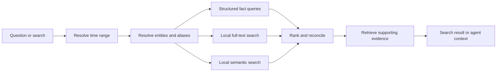

# Memory, search, and entities

**Status:** Ready for review.

This specification defines how Daylens turns evidence into retrievable memory, connects activity to durable entities, and answers exact or vague searches without making a model the source of recorded facts.

## Product behavior

Daylens memory should answer questions such as:

- “Where was the page with the best TV discount?”
- “What did I do for Project X last month?”
- “Which meetings did I have with ACME?”
- “Show me the article by Sean Goedecke about prompts and technical debt.”
- “What do I usually mean when I say the launch project?”

A person should not need to remember which application contained the information. Results explain what Daylens found, when it happened, how it is connected, and which evidence supports it.

## Memory types

Every memory has one explicit type:

| Type      | Meaning                                               | Example                                               |
| --------- | ----------------------------------------------------- | ----------------------------------------------------- |
| Observed  | Directly captured on the device                       | A page title was visible during a browser interval    |
| Connected | Retrieved from a consented external source            | A calendar event or GitHub pull request               |
| Supplied  | Explicitly entered or confirmed by the person         | “ACME is a client”                                    |
| Inferred  | Derived from other evidence and subject to correction | Several repositories and meetings belong to Project X |

The type, provenance, sensitivity, source time, and confidence remain available even when the product presents the result in natural language.

## Entities

The initial entity types are:

- application
- website and page
- file and document
- person
- meeting
- repository
- project
- client
- Timeline block
- AI thread

Each entity has a stable opaque identifier, canonical display name, aliases, source references, first and last observed times, sensitivity, and merge state.

### Identity rules

- Applications are resolved from platform identity, executable or bundle identity, profile identity, and normalized display name.
- Pages use normalized URL and source identity; page titles are attributes, not identity.
- People use connector identifiers first and normalized addresses or names only as supporting aliases.
- Meetings use source event identifiers. Similar titles and times alone do not silently merge events.
- Repositories use provider and repository identity, not a folder name alone.
- Projects and clients may be supplied, imported, or inferred from repeated relationships.
- One entity can have several aliases without losing the raw labels that produced them.
- Automatic merges must be reversible. Low-confidence candidates remain suggested relationships.
- An explicit merge, split, rename, or type correction outranks later inference.

Projects and clients are entities and filters across Timeline, Apps, search, and the AI agent. They are not separate top-level tabs in the first V2 desktop release.

## Memory record

A retrievable memory contains:

- stable memory identifier
- memory type
- concise factual statement
- source evidence identifiers
- related entity identifiers
- observed or effective time range
- confidence and provenance
- sensitivity and permission scope
- exact-search text
- semantic-search text
- embedding model and version when embedded
- creation, correction, and deletion state

A memory cannot exist without evidence unless it is explicitly supplied and confirmed. Generated prose is not itself factual memory.

## Retrieval flow

The retrieval planner narrows time and entities before semantic search. Numeric totals, durations, counts, and relationships come from structured queries. Full-text search owns exact titles, names, URLs, filenames, and quoted phrases. Semantic search helps when the person remembers meaning rather than wording.

## Local semantic search

- Embeddings are generated locally by default.
- The embedding model is versioned and replaceable.
- Embedding input is a minimized factual representation, not an entire raw day.
- High-sensitivity evidence is excluded unless its own specification permits embedding.
- Re-embedding runs in bounded background batches and can pause on battery or load.
- Search remains useful through structured and full-text paths when embeddings are unavailable.
- A remote embedding provider requires explicit opt-in and receives only the minimized permitted text.
- Changing models builds a new index before removing the previous valid one.

### Chosen engine

The default local engine is the pinned `Xenova/all-MiniLM-L6-v2` revision recorded by `bench/semantic-search` (384 dimensions, int8-quantized ONNX), running under transformers.js in the Electron runtime with `sqlite-vec` loaded through `better-sqlite3`. Embeddings can therefore live in the same SQLite database as the rest of memory and use the same deletion path. The decision run used a temporary file-backed database with the product's WAL, cache, mmap, and synchronous settings and a deterministic synthetic year of 109,500 memory records. That volume matches the 300 website visits/day in the existing heavy-year query fixture; it establishes a heavy synthetic scale, not a typical activity distribution.

The 2026-07-18 full run used Electron 34.5.8 / Node 20.19.1 on a 16 GB Apple M2 Pro while drawing from battery from start to finish. Both workers were forced offline after their exact model revisions had been cached. MiniLM indexed the year in 128.59 s at 852 records/s and 5.04 CPU-seconds per 1,000 records. Its isolated worker rose from 82 MB to a 357 MB process high-water RSS, and the vector database occupied 163.07 MB. After closing and reopening that database, its first query took 261.96 ms; across 50 query runs, end-to-end p95 was 62.30 ms against the 1-second budget. sqlite-vec returned valid ordered top-10 sets for all 50 runs, and actual indexed result IDs produced vague-memory recall@10 of 17/24.

Under the same conditions, `bge-small-en-v1.5` used its recommended query instruction and scored 13/24 recall@10. It took 271.57 s to index, consumed 9.48 CPU-seconds per 1,000 records, reached a 368 MB process high-water RSS, and produced 276.39 ms query p95. MiniLM is chosen because it had better measured retrieval quality while using 53% less full-build wall time and 47% less CPU in this run; both models remained inside the latency budget. The models ran sequentially in isolated workers, MiniLM first, so the exact comparative resource percentages include order and battery-state effects. The decision does not depend on those percentages: MiniLM also won the retrieval probe and independently cleared the latency budget. The benchmark does not establish absolute semantic quality beyond its synthetic probes.

The model choice stays versioned and replaceable per the invariants above; re-running the decision against a new candidate means re-running the benchmark, not re-opening the architecture. The committed evidence covers macOS arm64 on the named machine. Native-extension loading and the same latency/resource conclusions on packaged Windows, Linux, Intel macOS, and lower-powered supported machines must be verified during implementation; they are not inferred from this run.

## Ranking

Ranking combines:

- exact lexical match
- semantic similarity
- resolved entity match
- requested time-range fit
- source quality
- explicit corrections and confirmed relationships
- recency when the question implies it
- repeated corroboration across independent sources

The ranker does not use productivity, focus, or behavioral judgments. A more recent result does not outrank an exact requested date or entity.

## Conversational memory

The AI agent may suggest a durable memory when a conversation reveals a useful fact or preference, such as a project alias or client relationship.

- The proposed fact, affected entities, and future use are shown before saving.
- Nothing becomes durable until the person confirms it.
- Rejected proposals are not repeatedly suggested without new evidence.
- Confirmed conversational memory is `supplied`, not `observed`.
- A person can review, edit, forget, or delete it.
- Deleting an AI thread does not delete separately confirmed memory; the confirmation record explains why it remains.
- Secrets, credentials, health information, financial account data, and similar sensitive facts are never proposed automatically.

## Search interface

Search supports natural language and exact terms in one input.

Each result shows:

- a direct title describing what was found
- time or time range
- relevant project, client, person, meeting, or application
- a short matching excerpt or explanation
- source type
- an action to open the source or supporting Daylens evidence when available

Filters include date, application, website, project, client, person, meeting, and source. Filters change the same shared query used by the AI agent.

## Corrections and deletion

- Entity rename, merge, split, and relationship corrections are durable and reversible.
- Corrected identities reindex exact and semantic memory.
- Deleting evidence removes every memory and relationship that depends exclusively on it.
- A memory with other valid sources survives with updated provenance.
- Deleting a connector removes its source records, embeddings, aliases, and unsupported relationships.
- Forgetting conversational memory removes the saved fact and its retrieval entries.
- Sync tombstones prevent deleted memory from returning from another device.

## Failure behavior

- A failed embedding job leaves exact and structured search available.
- A corrupt index is rebuilt from permitted memory records.
- Entity-resolution uncertainty produces separate candidates or a clarification, never a silent destructive merge.
- A missing connector is identified only when it materially affects the requested answer.
- A stale result is invalidated when its evidence, correction, or permission changes.
- Search never falls back to sending the entire local database to a model.

## Acceptance criteria

- Exact fixtures retrieve titles, URLs, filenames, meetings, people, projects, and clients.
- Vague-memory fixtures retrieve the correct accepted result through local semantic search.
- Structured durations and counts reconcile with Timeline and Apps.
- Entity aliases, merges, splits, and corrections survive rebuild and restart.
- No conversational fact persists before confirmation.
- Search works without a model provider and without embeddings.
- Exclusions and deletion remove results from full-text, semantic, structured, AI, MCP, and sync paths.
- Retrieval results retain inspectable provenance without leading with telemetry.
- With a representative year stored locally, structured fact queries and exact full-text retrieval answer within 250 ms at the 95th percentile, and semantic retrieval within 1 second, on a representative laptop. `npm run bench:queries` documents the measurement basis; current hardware clears the non-semantic budgets by more than an order of magnitude.

## Implementation starting point

The first ticket should define entity and memory repository interfaces, then implement exact local retrieval over existing pages, window titles, files, meetings, and corrections. Semantic indexing should begin only after exact and structured retrieval use the canonical evidence boundary.
