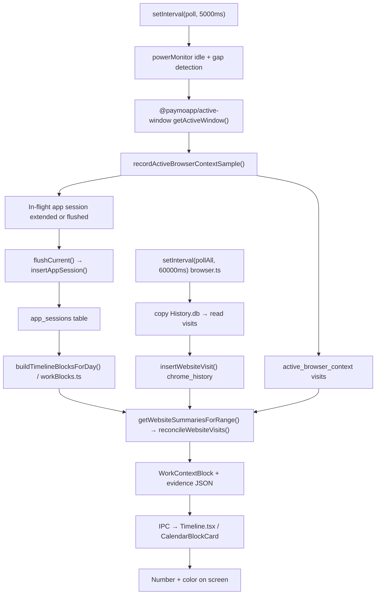

# Tracking Engine Architectural Critique — 2026-07-07

Read-only audit of how Daylens captures activity, reconciles it, and renders it.
Every claim below is tied to code or to verified DB findings in `docs/findings.md` and
`docs/issues-2026-07-06.md`. No fixes are proposed here — only what is, why it breaks,
and what fixing it would actually require.

---

## Part 1: What we built and why it keeps breaking

### End to end: `poll()` → a number on the Timeline



**Capture layer (every 5 seconds).** `startTracking()` in `tracking.ts` fires `poll()` immediately, then on a 5 s interval (`POLL_INTERVAL_MS = 5_000`, line 86). Each tick:

1. **Sleep-gap detection** — if wall-clock since last tick exceeds 60 s (`GAP_FLUSH_MS`), flush the open session at last evidence of activity and emit a backdated `away_start` (`tracking.ts:1573–1586`).
2. **Idle FSM** — `powerMonitor.getSystemIdleTime()` drives three states: `active`, `provisional_idle` (≥120 s, session held open), `away` (≥300 s, session flushed at true last-input time). Media/call/class sessions can stay open through idle via `passivePresence.ts` (`tracking.ts:1590–1637`).
3. **Foreground window** — `@paymoapp/active-window` returns the frontmost app (with macOS fallback to recent `focus_events` when titles are missing, `tracking.ts:1704–1766`).
4. **Browser tab sample** — before any session is created, `recordActiveBrowserContextSample()` reads the active tab (AppleScript on macOS, UIA/focus_events on Windows, history-DB fallback when script fails). Private windows abort capture entirely (`tracking.ts:1853–1870`, `browserContext.ts:388–429`).
5. **Session lifecycle** — same app → extend in-memory session and persist a live snapshot every 15 s; app switch → `flushCurrent()` → `insertAppSession()` with `durationSeconds`, category, canonical ids (`tracking.ts:1879–1937`, `1955–2075`).

**Parallel browser history (every 60 seconds).** `startBrowserTracking()` polls all installed browsers' History databases every 60 s (`browser.ts:470–475`). Each poll copies the entire History DB (+ WAL + SHM) to a temp file, reads new rows, estimates dwell from visit-to-visit gaps (5 s–1800 s clamp), and inserts `website_visits` with `source='chrome_history'` (`browser.ts:314–347`, `797–816`).

**Block layer.** Timeline blocks are built from `app_sessions` only — not from raw visits. `buildTimelineBlocksForDay()` (`workBlocks.ts:5059+`) either loads persisted `timeline_blocks` (processed days are frozen) or runs `buildBlocksForSessions()` → coarse segmentation at 15-minute gaps (`IDLE_GAP_THRESHOLD_MS`, `workBlocks.ts:113`, `895`). Live days use `buildProvisionalLiveBlocks()` — one neutral card per sitting (`workBlocks.ts:4913–4957`).

**Site evidence inside blocks.** For each block span, `getWebsiteSummariesForRange()` runs `reconcileWebsiteVisits()` — clips visits to browser foreground time, partitions seconds across tabs, excludes idle/sleep gaps (`queries.ts:2255–2471`). Category color comes from `weightedCategoryDistributionFor()` splitting browser seconds by `categoryForDomain()` (`workBlocks.ts:708–774`, `domainCategories.ts:114–126`).

**Render layer.** IPC sends `WorkContextBlock[]` to the renderer. `CalendarBlockCard` in `Timeline.tsx` displays span, active time, and `activityColorForCategory(block.dominantCategory)`. The detail panel uses `buildDetailRowTree()` to nest sites under owning browser rows (`blockDetailRowTree.ts:46–120`).

**What the user sees as "5h 45m in Dia"** is almost always the sum of `app_sessions.duration_sec` for Dia's bundle id in that block/day — foreground poll time, clipped by flush rules — not the sum of nested site rows (those are a breakdown of the same pool after reconciliation).

---

### Design decisions that made the bugs inevitable

| Bug we fought | Root design choice | Why it was inevitable |
|---|---|---|
| **Overnight 16h phantom** | One in-memory session survives until flush; recovery re-persists the live snapshot; interval timers freeze during sleep | Lid-close sleep often emits no `suspend`/`lock_screen` (Jul 6 DB proof in `findings.md`). Pre-fix, nothing detected a 9-hour poll gap. `recoverPersistedLiveSnapshot()` faithfully wrote poisoned spans (`tracking.ts:1301–1349`, `findings.md` 2026-07-06). |
| **Dia inflation / wrong sites** | Two independent clocks: `app_sessions` from 5 s foreground polls; `website_visits` from 60 s history polls + active-tab samples, with **estimated** history dwell | History rows accrue wall-clock gap to the *next* visit anywhere in the profile, including background tabs and idle (`browser.ts:326–336`). Until reconciliation (Jul 2–3), site rows summed beside app rows as if additive. |
| **Numbers not reconciling** | Same column `duration_sec` stores measured active-tab seconds and estimated history seconds; distinguished only by `source` | Any consumer doing `SUM(duration_sec)` without calling `reconcileWebsiteVisits()` lies. Three families still do (`queries.ts:3029–3083`, `aiTools.ts:457`, `workMemoryProfile.ts:488`). |
| **Colors wrong (one violet day)** | Browser app catalog category (Dia → `aiTools`) applied to **whole** browser sessions before site-weighting existed | Block distribution was purely per-app session category → one browser-centric day = one color (`findings.md` 2026-07-06). Site-weighting fixed forward paths but persisted AI blocks keep old labels until re-analyze. |
| **Sites not nesting** | Owner match requires `canonicalAppId` on both app summaries and visit rows; two bundle-id eras (exe path vs real bundle id) | 53 orphaned site rows simulated pre-backfill (`findings.md` 2026-07-06 evening). CSS padding bug made nesting invisible even when tree was correct. |

---

### Architectural tensions — two correct rules that contradict

1. **15-minute block gaps vs 45-minute day ownership.** Blocks split at 15 min idle (`workBlocks.ts:113`, `timeline.md` §3.1). Calendar day ownership keeps a sitting alive across midnight pauses under 45 min (`dayOwnership.ts:4–12`). A late-night work stretch can produce **multiple blocks on one calendar day** that **one day-ownership sitting** still treats as continuous — reconciling "one block = one sitting" with "one sitting = one day" requires careful reading of two specs.

2. **Provisional idle holds session open vs away flush trims to last input.** Between 120 s and 300 s idle, the session stays open and idle time is **credited to the app** on return (`tracking.ts:1621–1624`). At 300 s+, the same idle is **excluded** via flush at `provisionalIdleStart`. A 4-minute coffee break inflates app time; a 6-minute break does not. Users experience this as arbitrary.

3. **"Browser owns the time slot" vs "history is evidence when capture failed."** Reconciliation rule 5 keeps history visits in **signal-less gaps** (no foreground session) as countable evidence (`queries.ts:2309–2375`, `findings.md` Jul 2). That saves Zen-style capture failures but creates residual "No page recorded" minutes and can inflate browser totals when `app_sessions` missed foreground intervals (Jul 6–7 recovery scripts).

4. **Processed days frozen vs category facts stale.** Invariant 8: user corrections and AI labels survive rebuilds. Heuristic bumps (`timeline-v10`) refresh `dominant_category` in place but **never re-split overnight holes** in processed days (`issues-2026-07-06.md`, `refreshStaleBlockCategoryFacts` at `workBlocks.ts:4990–5028`). Color can update; shape cannot.

5. **Incognito never tracked vs Dia undetectable private windows.** Founder rule: private windows produce no session and no visit (`browserContext.ts:396–404`). Dia's AppleScript dictionary has no `mode of front window` (`browserContext.ts:121–123`, `issues-2026-07-06.md`). Title-regex fallback misses unmarked private windows — structurally unfixable without browser vendor support.

6. **Block span = wall-clock sitting vs active time = sum of sessions.** Block **height** uses span (start of first session → end of last in segment). **Active time** sums session seconds. Gaps inside a block (untracked passive, provisional idle credited, or missing flushes) make span ≠ active — flagged at 6 h (`SUSPICIOUS_UNBROKEN_BLOCK_SPAN_MS`, `workBlocks.ts:5043–5056`).

---

### Blast radius when capture breaks

| Failure | Immediate corruption | Downstream |
|---|---|---|
| **Open session not flushed** (sleep, missed app switch, stale dev build) | One `app_sessions` row absorbs hours; `live_app_session_snapshot` poisons recovery | Block span inflated; Dia total wrong; Cursor/Warp invisible; site visits clamped wrong until manual recovery from `focus_events` (`findings.md` 2026-07-07) |
| **Poll gap / away events wrong** | `activity_state_events` missing or mis-ordered | `reconcileWebsiteVisits` includes/excludes wrong intervals → site minutes wrong → category distribution wrong → block color/label wrong |
| **History copy fails** (Safari FDA) | Zero `webkit_history` rows | Safari invisible in site breakdown; AppleScript-only path for active tab |
| **Browser not in registry** | No history poll, no active context | App time still captured; **zero site detail** (Zen case, `findings.md` §2.2 — partially addressed via `browserRegistry.ts` Launch Services scan, but unknown browsers still depend on plist/http-handler detection working) |
| **Wrong bundle id era** | Visits under exe path, sessions under bundle id | Reconciliation pools split until canonical backfill; nesting fails (`findings.md` 2026-07-06) |
| **Processed day with bad blocks** | Persisted `timeline_blocks` kept | AI labels, wrap copy, and user memory of the day stay wrong until manual re-analyze |

The tracking layer is the **single source of poison**. Block builder, reconciliation, AI evidence, and UI are largely deterministic transforms — garbage in, garbage out, often **frozen** garbage for processed days.

---

## Part 2: The browser/site tracking question

### Why read browser SQLite history directly?

**What the code does.** Two paths:

- **Foreground active tab** (`browserContext.ts`) — AppleScript / Windows UIA / title-stable cache (30 s) / **history DB copy fallback** when script fails (`recentChromiumTab`, `copyHistoryDb` at lines 169–179, 201–223).
- **Background history poll** (`browser.ts`) — every 60 s, copy entire History DB, insert all new visits with estimated duration.

**Why this was chosen (inferred from architecture, not a comment):**

- No browser extension install friction.
- Works for Chromium family + Firefox + WebKit without per-browser extensions.
- History DB is the only cross-browser API that exposes URLs at rest.
- AppleScript tab reads are slow and block the main process; history copy was the fallback that "just works" when scripting fails.

### Tradeoffs vs alternatives

| Approach | Pros | Cons for Daylens |
|---|---|---|
| **History DB copy (current)** | No extension; all browsers; URLs + titles | Estimated dwell; background accrual; full DB copy on main thread; TCC/FDA gates; no incognito rows (but also no structural private signal for Dia) |
| **Browser extension** | Accurate tab focus events; real active tab duration | Install burden; per-browser maintenance; store policies; doesn't cover native apps |
| **OS network monitoring** | Sees all traffic | No page titles; VPN noise; privacy nightmare; no "foreground" semantics |
| **Accessibility / AX tree** | Foreground element, some URLs | Heavy permission; fragile; already partially used via `focusCapture.ts` helper for tab events — **not wired into session duration** |

### What this approach gets fundamentally wrong

1. **History time ≠ foreground time.** Chromium's `visit_duration` and Daylens's next-visit gap heuristic measure "time until something else happened in the profile," not "user looked at this tab" (`browser.ts:326–336`).

2. **Background tabs keep earning seconds.** A Meet tab in the background accrues gap until the next navigation — even while Warp is focused. Reconciliation clips most of this **if** foreground sessions are correct; when they are not, history over-counts (Jul 6: 46,062 s of visits in a 3 h window).

3. **Tab identity is inferred, not observed.** History fallback matches page title tokens to window title (`browserContext.ts:195–198`) — wrong tab when titles collide or lag.

4. **Unsolvable categories of problems:**
   - Private browsing without a scriptable mode (Dia).
   - Same-title tab switches within 30 s cache window (`TAB_CACHE_TRUST_MS`, `browserContext.ts:25`, `411–416`).
   - Profiles the app doesn't know about (portable browsers, VMs).
   - SPA in-tab navigation without history row (URL changes without visit record until poll).

### Cost of copying the whole History DB every uncached read

`copyHistoryDb` uses **`fs.copyFileSync`** for DB + WAL + SHM on the **Electron main thread** (`browserContext.ts:169–177`). Triggered on:

- Every active-tab read that misses AppleScript (Linux always; macOS/Windows fallback).
- Every 60 s browser poll per installed browser (`browser.ts` poll functions).

**Costs:** multi–tens-of-MB synchronous copy; main-process jank every ~5–30 s of heavy browsing (`issues-2026-07-06.md` §2 HIGH). **Failure modes:** Safari EPERM without Full Disk Access (fixed to surface in Settings, `findings.md` Jul 3); locked DB if browser holds write lock; stale WAL if copy mid-transaction; disk fill from temp files if cleanup fails (`cleanupHistoryCopy` is best-effort).

### Better primitive

The honest minimum: **event-sourced foreground intervals with observed tab identity**, not inferred history dwell.

Concrete primitive:

```
FocusInterval { start, end, app, windowTitle?, tabId?, url?, source: observed|inferred }
```

- **Observed** from: `NSWorkspace` notifications + Accessibility tab events (already in `focusCapture.ts:15–25`) and Chromium AppleScript when available.
- **Inferred** from history only as a **last-resort gap fill**, flagged `duration_estimated=true`, never summed without reconciliation.

History DB becomes a **backfill source**, not a 60 s parallel clock. That requires either a lightweight extension/message channel for Chromium browsers **or** elevating the native capture helper to own tab lifecycle on macOS/Windows.

---

## Part 3: The 5-second poll model

### What polling gets right

- **Simple mental model** — one loop, easy to test (`trackingIdleFsm.test.ts`, `trackingSleepGap.test.ts`).
- **Cross-platform** — `@paymoapp/active-window` abstracts macOS/Windows/Linux.
- **Low permission surface** — no kernel extension; Accessibility for titles is optional enhancement.
- **Predictable DB write rate** — sessions flush on switch/away, not every tick.
- **Coalesced invalidation** — timeline rebuilds throttled to 15 s windows (`tracking.ts:107–114`) so a long day doesn't rebuild on every app switch.

### What polling structurally gets wrong

| Issue | Mechanism |
|---|---|
| **Cold start** | First session starts at first successful poll, not at login. Up to 5 s blind spot; worse if permission denied. |
| **5 s granularity** | Sub-5 s app switches collapse into one session or drop under `MIN_SESSION_SEC = 10` (`tracking.ts:88`). |
| **Gap semantics** | Time between polls is attributed to whichever session is open — unless flush fires. Provisional idle **includes** 2–5 min idle in session duration. |
| **Idle detection accuracy** | `getSystemIdleTime()` is keyboard/mouse only — watching video, reading, on a call without input depends on `passivePresence.ts` heuristics. |
| **Two-clock problem** | Session **start** often = poll wall clock; session **end** on away = last input from idle counter (`tracking.ts:1958–1967`, 1886–1894). Fixed for overlap discard; still means duration semantics are hybrid. |
| **Sleep** | Interval timers don't run during sleep — gap detection is necessary because power events are unreliable (`tracking.ts:91–98`). |
| **Async inside sync loop** | `poll()` is `async` but history/tab reads use sync I/O (`copyFileSync`, `execFileSync` 1.5 s timeout) — blocks main thread. |

### Event-driven alternative on macOS/Windows

**Events Daylens already has:**

- `powerMonitor`: lock/unlock/suspend/resume (`tracking.ts:1453–1457`)
- `focusCapture` helper: app_activated, window_changed, tab_changed, sleep/wake/lock/unlock (`focusCapture.ts:15–25`)
- `activity_state_events` table for idle/away/sleep taxonomy

**Events Daylens ignores for session accounting:**

- Per-event app activation (helper emits; tracker still polls for duration)
- Tab changes as session boundaries (visits yes, app sessions no)
- Display sleep/wake independent of system suspend (partially covered by poll gap)
- Screen lock without suspend (sometimes missing, per Jul 6)

**Event-driven model:**

```
on foreground_changed → close interval, open interval
on tab_changed → close browser context, open context
on idle_threshold → end interval at last_input
on sleep/wake → close at last_input, gap record
```

Polling becomes a **watchdog** (detect missed events, recover from helper crash), not the primary clock.

### Is polling the right core primitive for a precise product?

**No — not at 5 s as the authoritative clock.** Daylens claims precision in the Timeline ("5h 45m") but measures **poll-sampled foreground presence with hybrid idle semantics**, not continuous attention. Screen Time uses different OS hooks and per-display rules; parity within minutes is the realistic bar (`issues-2026-07-06.md`).

Polling is acceptable for **"which app was frontmost, roughly how long"** if flushes are bulletproof. It is not acceptable as the **only** clock for browser site attribution or sub-minute work switching without the event layer driving boundaries.

---

## Part 4: What the product measures vs what users think

### What "5h 45m in Dia" means

In Daylens's model it is:

> Sum of `app_sessions.duration_sec` where Dia was the **foreground application** according to `@paymoapp/active-window`, minus sessions dropped for noise/incognito/controls, clipped by flush boundaries (app switch, away ≥300 s idle, sleep gap, midnight split).

It is **not**:

- Active typing time
- Eye-on-screen time
- Dia-specific engagement (sidebar vs foreground tab)
- Sum of nested website rows (those are reconciled **subtractions/partitions** of browser time, not additive)

Nested sites under Dia should sum to **≤ Dia header time** after reconciliation; residual "No page recorded" covers the gap (`blockDetailRowTree.ts:114–118`).

### vs macOS Screen Time

| Dimension | Daylens | Screen Time (approximate) |
|---|---|---|
| **Unit** | Foreground poll sessions | Per-app/per-display usage APIs |
| **Idle** | 120 s provisional hold; 300 s away flush; media exception | OS-defined idle, different thresholds |
| **Background media** | May count as app time if passive presence holds session | Often counts separately |
| **Browser sites** | Reconciled history + active tab | Limited site categorization |
| **Sleep** | Poll gap + power events | System-level pause |

Post Jul 6 fixes, per-app totals should be **same order, within minutes** on a good day (`findings.md` 2026-07-07 Screen Time cross-check). Equality is not a design goal.

### What users trust that we cannot guarantee

- **Completeness** — if the tracker didn't flush, data is wrong or absent until recovery.
- **Site breakdown accuracy** — history estimates + reconciliation; background tabs can still leak through bad foreground data.
- **Category/color = intent** — rule-based hosts + heuristics; `dominantCategoryForBlock` can relabel browsing-dominant blocks to largest focused sub-category (`workBlocks.ts:542–590`).
- **Processed day shape** — AI-labeled blocks can enshrine wrong boundaries forever.
- **Cross-view equality** — Timeline/App Detail/AI tool-loop can disagree when a path bypasses reconciliation.

### Silent over-count

- Provisional idle 120–300 s credited to foreground app.
- History visit duration before reconciliation (raw rows in DB always overstate).
- `recoverPersistedLiveSnapshot` using `lastSeenAt` from stale snapshot (pre-fix overnight).
- Same browser credited under two bundle-id forms before canonical pool merge (fixed Jul 6).
- Capture-gap rule 5 counting history when `app_sessions` missing but user was actually in another app (recovery case).

### Silent under-count

- Sessions under 10 s dropped (`MIN_SESSION_SEC`).
- Sub-15-minute sittings dropped on live day except the current sitting (`buildProvisionalLiveBlocks`, `workBlocks.ts:4928–4933`).
- Incognito/private (intentional).
- Tracking Controls exclusions.
- System noise (`isSystemNoiseApp`, `loginwindow`, etc.).
- Browser not in registry → no site rows (app time still captured).
- Away ≥300 s: correct exclusion, but user may think "I was still reading."

---

## Part 5: What a 10x better tracking system looks like

Not "better heuristics." A different architecture.

### Signals to capture that we miss today

| Signal | Source | Why it matters |
|---|---|---|
| **Tab focus changes with URL** | AX / extension / helper | True site boundaries |
| **Input activity** (not just idle timer) | IOHID or lightweight hook | Distinguish reading vs away |
| **Display on/off** | CoreGraphics/display sleep | Sleep without suspend |
| **Audio playback state** | CoreAudio | Passive media without title heuristics |
| **Meeting presence** | Calendar + mic/camera OS indicators | Classes/calls without keystrokes |
| **File path / git repo** | NSWorkspace doc URLs, shell cwd | Intent for dev blocks (attribution.ts exists but downstream of broken capture) |

### Signals to stop treating as truth

- History next-visit gap as dwell duration (store only as hint).
- Window title as stable tab identity (30 s cache conflates tabs).
- Single `duration_sec` column for measured vs estimated.
- Live snapshot `lastSeenAt` as end time without cross-check against `focus_events`.

### Data model rebuilt from scratch

```
events           — immutable append-only (focus, tab, idle, sleep, input)
intervals        — materialized foreground segments (app, optional url)
interval_sites   — browser sub-intervals (partition of parent, never overlapping)
days             — derived blocks from intervals + user corrections
block_evidence   — single JSON blob per block, all surfaces read this
```

Rules:

1. **One interval graph** — Timeline, Apps, AI read the same intervals.
2. **Sites partition browser intervals** — Σ sites = browser interval ± explicit residual.
3. **Estimated flag** on any history-derived segment.
4. **Corrections overlay** — span fusion/split keyed by wall-clock, not session ids (lesson from merge namespace bug, `findings.md` Jul 2).

### Stack changes required

- **Native capture helper** (already exists for macOS) becomes **primary**, not sidecar — Rust/Swift daemon with AX + workspace notifications.
- **Chromium**: small native messaging host or system browser extension for tab events — one codebase, sideloaded/dev channel first.
- **Main process** stops synchronous History copies — worker thread or readonly WAL snapshot API.
- **SQLite schema vNext** — collapse `app_sessions` + `website_visits` + `activity_segments` write paths into `events` → nightly `intervals` materialization.
- **Delete duplicate hydration** — one `WorkContextBlock` builder (`workBlocks.ts` ~4740 vs ~5630 drift noted in findings).

### Minimum viable version shippable in 4 weeks

Not the full rebuild — a **dual-clock elimination** milestone:

1. **Week 1:** Promote `focus_events` to drive session **start/end** on macOS (helper already emits); keep 5 s poll as watchdog only. Prove on founder machine: no phantom sessions across sleep/app-switch matrix.

2. **Week 2:** History poll moves to worker thread; copy only when mtime changes; mark all `chrome_history` rows `duration_estimated=1`. Route `getDistractionBy*`, `aiTools`, `workMemoryProfile` through `reconcileWebsiteVisits`.

3. **Week 3:** Single `block_evidence` builder feeding Timeline detail + AI resolver; include page titles/window titles in evidence (fix findings §2.3 starvation).

4. **Week 4:** Dia/Chrome tab bridge prototype (AppleScript + mode check where available; extension stub for Dia). Acceptance: Screen Time parity ±5 min on 5 consecutive days; no block span > 2× active sum without logged flag.

---

## Part 6: Category and classification

### Current approach

1. **App category** — regex rules on bundle id + app name (`tracking.ts:2084–2144`), catalog overrides (`app-normalization.v1.json`), browser apps forced to `browsing` in registry path.

2. **Site category** — static host → category map (`domainCategories.ts:20–102`) + leisure sinks from `domainPolicy.ts`.

3. **Block category** — `weightedCategoryDistributionFor` splits browser session seconds by reconciled site categories; non-browser sessions keep app category (`workBlocks.ts:708–774`).

4. **Display category** — `dominantCategoryForBlock` merges distribution with top page artifact, with leisure/work guardrails (`workBlocks.ts:542–590`, `blockCategoryDominance.test.ts`).

### Is rule-based + site-weighted right?

**Half right.** Site-weighting fixes the "one browser color for the whole day" failure mode. Rule-based hosts are auditable and fast.

**Wrong parts:**

- Host list is incomplete and stale by design — unknown hosts stay `browsing`.
- App regex conflates **container** (Dia) with **content** (claude.ai) — site-weighting fixes blocks but Apps list header category can still mislead.
- `dominantCategoryForBlock` intent relabeling (browsing → development if focused share > 30%) surprises users who expect plurality color.
- No learning from user corrections at host level — corrections stick per block, not per domain.

### Categories wrong by design

| Category | Problem |
|---|---|
| **`browsing`** | Junk drawer for "browser with unknown sites" — too broad to be meaningful intent. |
| **`aiTools` for browser apps** | Was catalog-default for Dia/Comet; recataloged to `browsing` but regex still catches app *names* containing "claude" (`workBlocks.ts:625`). |
| **`research` for GitHub** | Reading vs coding is context-dependent; rule can't distinguish. |
| **`meetings` vs `communication`** | Zoom in browser tab vs Zoom.app depends on title/host detection. |

### Missing categories

- **Learning** (courses, tutorials) — folded into passive presence or entertainment.
- **Admin** (settings, billing, HR portals).
- **Context: "waiting"** (blocked on CI, long builds) — looks like development.

### Category that most often gets wrong answers

**`entertainment` / leisure from browser blocks** — because history over-counts YouTube/Netflix in background tabs, and artifact override logic had to be hardened twice (`findings.md` Jul 3, Jul 6). Root cause is capture/reconciliation, but classification pays the price.

Second: **`aiTools` vs `development`** on AI-assisted coding days — Cursor + Claude web + GitHub splits across categories with relabel rules users don't see.

### Better classification signal

Priority order:

1. **Reconciled foreground seconds per (domain, app)** — already partially there.
2. **User correction memory** — domain → category overrides persisted (`getCategoryOverrides` in queries).
3. **Page title semantics** — not longest dwell; prefer specific titles (`isGenericIndexTitle`, `queries.ts:2480–2486`).
4. **File/repo attribution** from attribution pipeline when window titles exist.
5. **LLM labeling at block finalize only** — not per-poll; frozen after Analyze.

Replace static host list growth with **correction-driven catalog** + small allowlist for head sites.

---

## Part 7: Known issues documented but not fixed

Sources: `docs/issues-2026-07-06.md`, `docs/findings.md` (through 2026-07-07). Items marked FIXED in those docs are omitted.

### Tracking / data integrity

| Issue | Risk | Fix effort | Shipping blocker? |
|---|---|---|---|
| **Dia private windows not structurally detectable** | Private browsing tracked as normal if title unmarked | Requires Browser Company API or extension; title regex incomplete | **Medium** — privacy-sensitive users |
| **Historical processed days keep wrong block boundaries** | Wrong overnight shapes, wrong AI labels persist | Bulk re-analyze with founder approval; or policy change to allow heuristic re-split | **Medium** — trust on past days |
| **Per-poll synchronous full History DB copy** | Main-thread jank; battery | Worker thread + mtime-gated copy or readonly SQLite URI | **High** for quality; **Low** for MVP if founder tolerates stutter |
| **Raw `SUM(duration_sec)` in distraction + AI + work memory** | Insights/AI cite inflated site times | Route through `reconcileWebsiteVisits`; ~3 call sites | **Medium** — AI answers wrong |
| **`chrome_history` durations indistinguishable from measured** | Any new consumer repeats double-count bug | `duration_estimated` column + migration | **Low** — tech debt |
| **Stale `evidence_summary_json` on pre-v10 blocks** | Missing canonical ids in archived evidence | Rebuild evidence on heuristic bump or read-time-only (partial fix exists) | **Low** |
| **Two parallel `WorkContextBlock` hydration paths** | Drift bugs like zero-second site fabrication | Extract single builder | **Low** — maintenance |
| **`recoverPersistedLiveSnapshot` trusts poisoned snapshot** | Repeat Jul 6–7 disasters after crash | Cross-check against `focus_events` before persist | **High** |
| **Screen Time parity not exact** | User confusion | Documentation + expectations; not a code bug | **No** |

### Capture / evidence (from earlier findings, still largely open)

| Issue | Risk | Fix effort | Blocker? |
|---|---|---|---|
| **Window titles sparse in evidence** | AI names blocks "Computer activity" | Permission audit + capture path hardening + evidence assembler join | **High** for AI quality |
| **Evidence assembler starves AI** (`pages: []`) | Bad names/summaries even when data exists | Rebuild `evidence_summary_json` from visits/segments | **High** for AI quality |
| **AI tab agentic tool-loop fallback** | Fragile answers | Resolver-first teardown (`findings.md` §3.1) | **Medium** |
| **AI block naming requires manual Analyze** | Live day neutral labels | Auto-analyze gating exists; naming quality still open | **Low** |
| **Span vs active time disagreement** | Block height misleading | Fix capture holes; passive time rendering | **Medium** |

### Security (not tracking but in sweep)

| Issue | Risk | Fix effort | Blocker? |
|---|---|---|---|
| **Auto-updater installs unverified bundles** | Silent malicious install | SHA256 + signature in feed; verify before quarantine strip | **Critical** for public release |
| **AI sanitizer over-redacts long tokens** | Degraded AI on hash/id questions | Entropy-gate backstop | **No** |

### Not yet audited (explicit boundary from issues doc)

| Item | Risk | Fix effort | Blocker? |
|---|---|---|---|
| **Invariant 7 trace of every raw `SUM(duration_sec)`** | Unknown drift | Grep + route all to reconciliation | **Medium** |
| **Renderer-wide + all AI provider sanitization** | Leak or over-redact | Audit pass | **Medium** for privacy |

---

## Summary judgment

Daylens's tracking stack is a **layered patchwork**: 5 s foreground polling, 60 s history polling, reconciliation bolted on after double-counting shipped, block engine with five schema notions of "block," and frozen processed days that preserve mistakes.

The Jul 2026 bug cluster (overnight phantoms, Dia inflation, colors, nesting) was not bad luck — it was the predictable output of **two uncorrelated clocks** (poll sessions vs history visits), **flush semantics that credit idle to apps**, and **downstream UI that trusted raw DB columns**.

The fixes applied (sleep gap, reconciliation, site-weighted categories, incognito gate, canonical id backfill) are real but **local**. They do not change the primitive: **polling + history inference on the main thread, with hybrid idle accounting.**

A product that claims calendar truth needs **event-sourced foreground intervals**, **history as hint not clock**, and **one evidence object per block** — everything else is reconciliation debt.

---

*Audit method: parallel read-only review of `tracking.ts`, `browserContext.ts`, `browser.ts`, `queries.ts` (`reconcileWebsiteVisits`), `workBlocks.ts`, `domainCategories.ts`, `blockDetailRowTree.ts`, `focusCapture.ts`, plus `docs/findings.md` and `docs/issues-2026-07-06.md`. No code was modified.*
